##

:::{.absolute style="top:185px;left:260px;width:523px;font-size:26px;color:var(--ink);font-weight:400;text-align:left;line-height:1.2;"}
Dungeons & Dragons
:::

:::{.absolute style="top:317px;left:274px;width:502px;font-size:26px;color:var(--ink);font-weight:400;text-align:left;line-height:1.2;"}
  
The Security Power Tool You Didn’t Know You Needed  
  
  
  
  
  
  
Wild West Hackin’ Fest, Oct 10 2025
:::

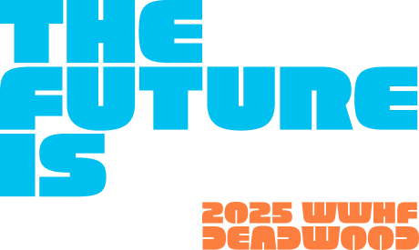{.absolute top=500 left=427 width=210}

::: {.notes}
No reason to take photos of slides
Last slide will be a QR
:::

## {background-color="#e2dfd3"}

:::{.absolute style="top:283px;left:265px;width:520px;font-size:64px;color:var(--ink);font-weight:400;text-align:center;line-height:1.2;"}
Who are we?
:::

## {background-image="images/s03_bg.png" background-size="cover"}

::: {.notes}
If you have black pets… 
Live in Copenhagen with wife and two shelter cats (brother/sister)
20 years in security
Internal, external consultant, security architect at several companies
Career took a turn into marketing
Head of community at open-source security company until Dec 2022
Then back into advisory: Went freelance to help companies get secure
Also doing community-focused marketing for companies that don’t want annoying marketing nobody cares about.
Spoiler alert: There aren’t many of those, strangely enough
Went freelance to do fun stuff
Always had a thing for games to learn security
Jumped at this possibility to mix cyber security with D&D
Am here to convince you to do the same
:::

## {background-image="images/s04_bg.png" background-size="cover"}

##

:::{.absolute style="top:171px;left:208px;width:692px;font-size:29px;color:var(--ink);font-weight:400;text-align:left;line-height:1.2;"}
The problem with traditional training  
Your brain is wired for games and social learning  
Role playing games create immersive, engaging experiences  
Meet HackBack: Security training that doesn’t suck
:::

:::{.absolute style="top:61px;left:83px;width:885px;font-size:26px;color:var(--ink);font-weight:400;text-align:left;line-height:1.2;"}
Agenda
:::

::: {.notes}
Traditional training approaches broken
Class-based, computer-based, even TTX often dull
Your brain actually wired for games and social learning
Science backs this up - not just opinion
Role-playing games particularly immersive
Create engaging experiences, players forget egos and much more
HackBack = practical solution
D&D mechanics applied to security training
Framework for any scenario, not just IR
Free to use - I’ll tell you how to get started!

But first, let’s talk about game-based learning in general
:::

##

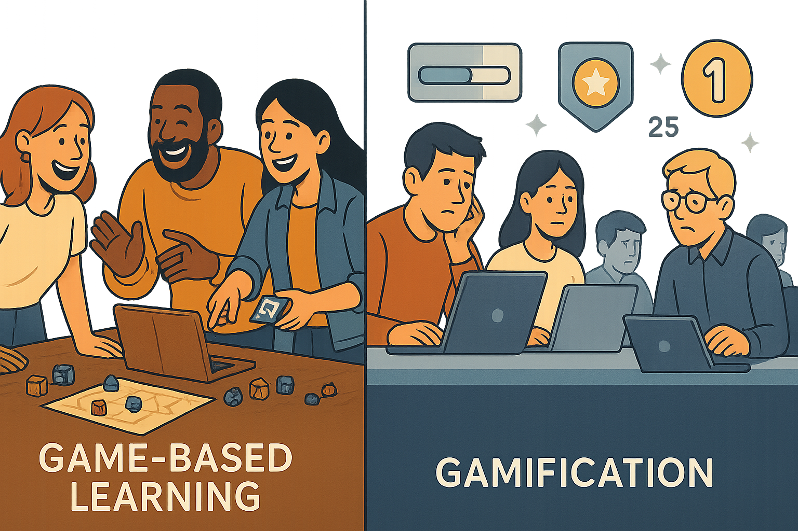{.absolute top=147 left=183 width=716}

:::{.absolute style="top:270px;left:262px;width:526px;font-size:51px;color:var(--ink);font-weight:400;text-align:center;line-height:1.2;"}
Not gamification
:::

:::{.absolute style="top:61px;left:83px;width:885px;font-size:53px;color:var(--ink);font-weight:400;text-align:left;line-height:1.2;"}
Game-based Learning 101
:::

::: {.notes}
<DON’T CLICK>
We’ll be talking about game-based learning a lot. So it’s important to know what it is (and isn’t).
Game-based learning = playing actual games to learn
Game itself is what teaches you
In contrast to that is 
Gamification = adding game elements to motivate
Example: "First team to finish security training gets cake"
Gamification is about motivation (sometimes feeling fake), is not learning method
When we’re talking about game-based learning
We're talking about actual games as educational tools
Games that have inherent learning mechanics
Not just making boring things "fun" with points/badges or cake
So in other words:
<CLICK>
Will not be talking about gamification today
:::

##

:::{.absolute style="top:61px;left:83px;width:885px;font-size:26px;color:var(--ink);font-weight:400;text-align:left;line-height:1.2;"}
What’s the problem with training?
:::

:::{.absolute style="top:178px;left:82px;width:632px;font-size:36px;color:var(--ink);font-weight:400;text-align:left;line-height:1.2;"}
Traditional approaches:  
Class-based  
Computer-based  
  
Specifically for IR:  
Tabletop exercises
:::

:::{.absolute style="top:321px;left:91px;width:463px;font-size:36px;color:var(--ink);font-weight:400;text-align:left;line-height:1.2;"}
Problem: Often really dull
:::

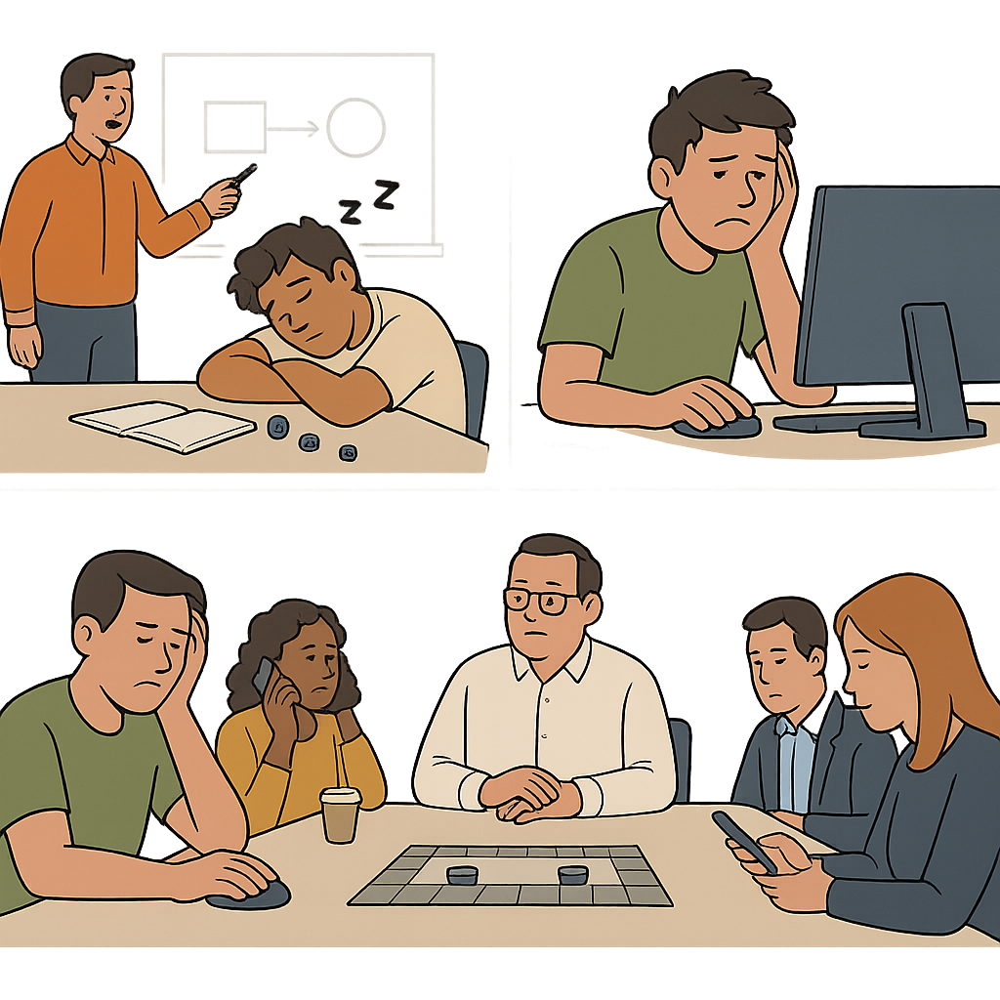{.absolute top=160 left=539 width=358}

::: {.notes}
Traditional approaches to training: 
Class-based
Computer-based training
Theoretical, intellectual, doesn't fit all (or any) learning styles
And specifically in IR: Tabletops
Should be better - practical approach
BUT
Reality = dull, no engagement
People don’t join unless they’re forced to
NOT because they want to.
I find that a huge problem (that might be a bit hidden)
I mean: people are present - physically, at least

Now, let’s talk more about tabletops in general
:::

##

:::{.absolute style="top:61px;left:83px;width:885px;font-size:26px;color:var(--ink);font-weight:400;text-align:left;line-height:1.2;"}
Tabletops 101: What and why?
:::

:::{.absolute style="top:178px;left:82px;width:466px;font-size:41px;color:var(--ink);font-weight:400;text-align:left;line-height:1.2;"}
Build ‘muscle memory’ on incident handling  
  
Tabletops (TTX)  

:::

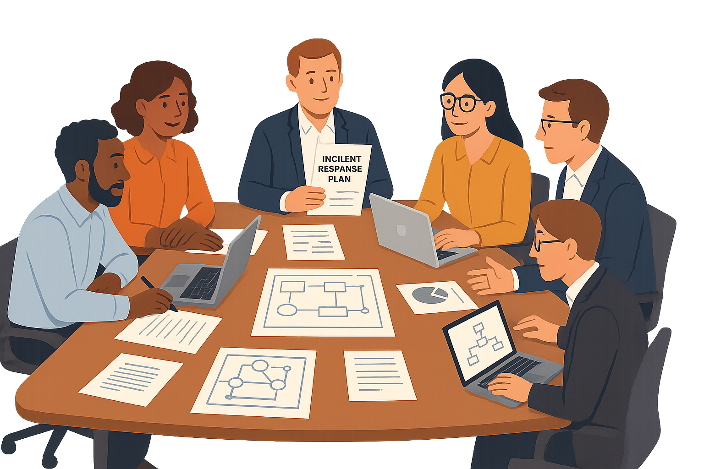{.absolute top=190 left=573 width=431}

::: {.notes}
But first let me talk about what a tabletop exercise is and why we do them

<CLICK>
Better incident handling when everyone knows their role 
Cost-effective way to train teams
<CLICK>
TTX = Table Top Exercises
Goal = preparedness, coordination

But... what's the problem with how we do them?
:::

##

:::{.absolute style="top:61px;left:83px;width:885px;font-size:26px;color:var(--ink);font-weight:400;text-align:left;line-height:1.2;"}
Ye traditional IR TTX  
(and why they can suck..)
:::

:::{.absolute style="top:167px;left:83px;width:475px;font-size:29px;color:var(--ink);font-weight:400;text-align:left;line-height:1.2;"}
Generally speaking:  
Participants don't open up  
Egos clashing  
People fight the scenarios  
Rote and scripted  
  
Most important:  
No focus on engaging participants  
'Fun' is taboo
:::

:::{.absolute style="top:619px;left:-249px;width:344px;font-size:29px;color:var(--ink);font-weight:400;text-align:left;line-height:1.2;"}
Result: Dull → No engagement → No learning
:::

:::{.absolute style="top:234px;left:119px;width:344px;font-size:29px;color:var(--ink);font-weight:400;text-align:left;line-height:1.2;"}
Result:  
Dull →  
No engagement →  
No learning →  
No point!
:::

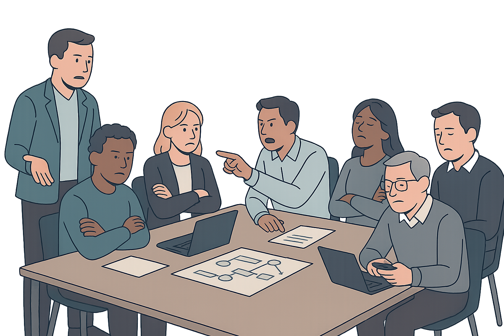{.absolute top=202 left=571 width=432}

::: {.notes}
<DON’T CLICK>
Disclaimer:
Before I start talking about how much your TTX sucks, 
I first want to say that they can be done in myriads of ways. 
So you might not do it like this. Actually you might be doing tabletops people enjoys. 
In that case I apologize.

I’ve had almost 20 years experience observing TTX
<CLICK>
This is what I see
<CLICK> People protect own turf, not honest
<CLICK> Egos clashing
<CLICK> Fighting scenario = "not possible in our environment"
Most important:
<CLICK> No focus on engaging (Locked Shields)
<CLICK> And the cardinal sin: 
Fun seen as unprofessional
<CLICK> The result?
Dull = forced attendance = no learning = no purpose
So is there another way?
Funny you should ask: YES!
Let’s talk about that now - and why it works.
:::

##

:::{.absolute style="top:61px;left:83px;width:885px;font-size:26px;color:var(--ink);font-weight:400;text-align:left;line-height:1.2;"}
Game-Based Learning
:::

:::{.absolute style="top:214px;left:97px;width:856px;font-size:35px;color:var(--ink);font-weight:400;text-align:left;line-height:1.2;"}
Most studies in the sample reported analog GBL as an effective pedagogical tool with an impact on the learning, cognitive, and psychological levels.
:::

:::{.absolute style="top:506px;left:126px;width:792px;font-size:20px;color:var(--ink);font-weight:400;text-align:left;line-height:1.2;"}
Article from the media Frontiers in Psychology: Playing at the school table: Systematic literature review of board, tabletop, and other analog game-based learning approaches
:::

::: {.notes}
<DON’T CLICK>
‘Because it’s fun’  is an unconvincing argument in real life
Turn to science for authority
Luckily, research backs up game-based learning
<CLICK>
Read quote
Quote from Frontiers in Psychology study
So that’s GBL. Why exactly does it work?
Let’s look into that.
:::

##

:::{.absolute style="top:178px;left:82px;width:866px;font-size:31px;color:var(--ink);font-weight:400;text-align:left;line-height:1.2;"}
I think we’re all impressed by how stupid humans are. It reaches almost epic proportions. We’re stupid in dozens and dozens of ways but human minds are plug-and-play devices; they’re not meant to be used alone. They’re meant to be used in networks. Games allow us to do that – they allow us to use collective intelligence. Collectively, we’re not so stupid.
:::

:::{.absolute style="top:61px;left:83px;width:885px;font-size:34px;color:var(--ink);font-weight:400;text-align:left;line-height:1.2;"}
Your Brain is Wired for Learning With Others
:::

:::{.absolute style="top:525px;left:151px;width:745px;font-size:21px;color:#ffffff;font-weight:400;text-align:left;line-height:1.2;"}
Article summing up panel debate at Stanford Graduate School of Education, quoting James Gee, an Arizona State University: Playing to learn: Panelists at Stanford discussion say using games as an educational tool provides opportunities for deeper learning.
:::

::: {.notes}
<DON’T CLICK>
Here’s my favorite quote
<CLICK>
Read quote
Explain:
Plug-and-play devices = meant for creating networks
Games enable collective intelligence
Together we're smart
Many ways to implement team learning
We chose role-playing games
A good way to combine
Real life experience with both IR and D&D

Luckily science backs us up here too
:::

##

:::{.absolute style="top:178px;left:112px;width:827px;font-size:38px;color:var(--ink);font-weight:400;text-align:left;line-height:1.2;"}
When Dungeons & Dragons and its cousins are played in an inviting, encouraging, compassionate, and intellectually engaged environment, play opens the door to truly amazing possibilities for learning.
:::

:::{.absolute style="top:61px;left:83px;width:885px;font-size:26px;color:var(--ink);font-weight:400;text-align:left;line-height:1.2;"}
Why Role Playing Games?
:::

:::{.absolute style="top:543px;left:117px;width:786px;font-size:20px;color:#ffffff;font-weight:400;text-align:left;line-height:1.2;"}
Article quoting David Simkins, a professor at the Rochester Institute of Technology, who is an expert on games and learning: How ‘Dungeons & Dragons’ Primes Students for Interdisciplinary Learning, Including STEM
:::

:::{.absolute style="top:233px;left:161px;width:728px;font-size:45px;color:var(--ink);font-weight:400;text-align:center;line-height:1.2;"}
We’re geeks.  
So we’ll take any excuse to do D&D as part of our grown-up jobs  
You probably will too
:::

::: {.notes}
<CLICK>
Read quote
D&D primes students for interdisciplinary learning
But honestly, that’s not the real reason
<CLICK>
Scientific backing DO exist
We're geeks
Take any excuse to do D&D in grown-up jobs
Let’s be honest: You’ll probably want that too
I mean why else would you be here? :-D
:::

##

:::{.absolute style="top:177px;left:92px;width:496px;font-size:31px;color:var(--ink);font-weight:400;text-align:left;line-height:1.2;"}
Players laugh. A lot!  
  
When players are immersed, they  
Forget their egos  
Forget to protect their turf  
Forget to fight the scenario  
Are more honest in general
:::

:::{.absolute style="top:61px;left:83px;width:885px;font-size:26px;color:var(--ink);font-weight:400;text-align:left;line-height:1.2;"}
Roleplaying is immersive
:::

:::{.absolute style="top:207px;left:214px;width:340px;font-size:58px;color:#eeeeee;font-weight:400;text-align:left;line-height:1.2;"}
Bonus  
Empathy  
‘Lifelike’ simulation
:::

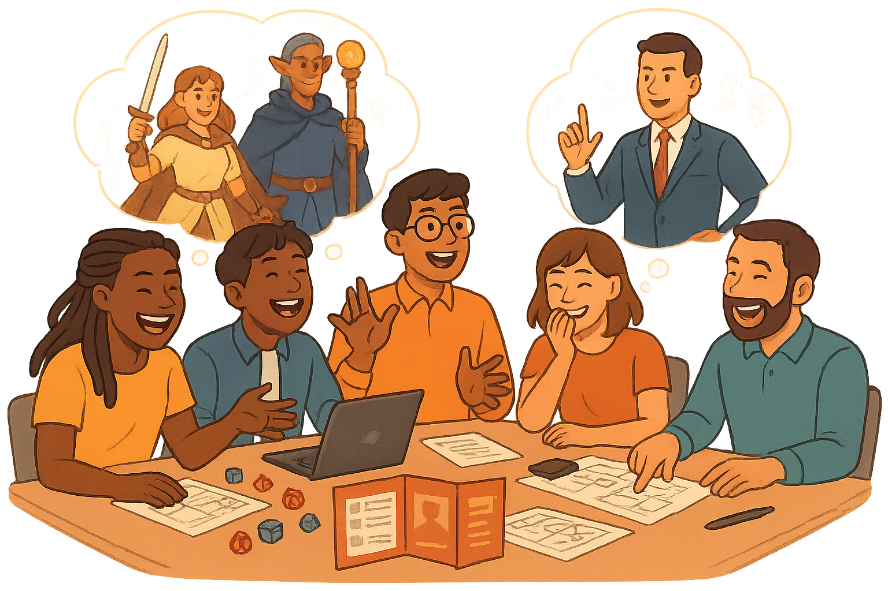{.absolute top=207 left=596 width=406}

::: {.notes}
<DON’T CLICK>
D&D successful for a reason
<CLICK>
Players act differently than traditional TTX
They laugh. A lot.
Fun = engagement = immersion
Forgetting all the negatives, ego, turf, fighting scenarios, holding back
And as an unexpected bonus:
<CLICK>
Empathy: switch roles, technical person as head of communication
More lifelike simulation - actions divided among players
One person can't do everything
Also what if that person is taken out during an incident?
You’d be surprised how often a traditional TTX doesn’t cover this

Enough chitter-chatter. Let’s get down to business.
Let’s talk about out game and how you can get to play it yourself!
:::

##

:::{.absolute style="top:178px;left:82px;width:541px;font-size:36px;color:var(--ink);font-weight:400;text-align:left;line-height:1.2;"}
Stories create emotional investment  
Context bridges theory and practice  
The IM as narrative guide  
When players say "I need to" instead of "we should"
:::

:::{.absolute style="top:61px;left:83px;width:885px;font-size:26px;color:var(--ink);font-weight:400;text-align:left;line-height:1.2;"}
The Role of Storytelling
:::

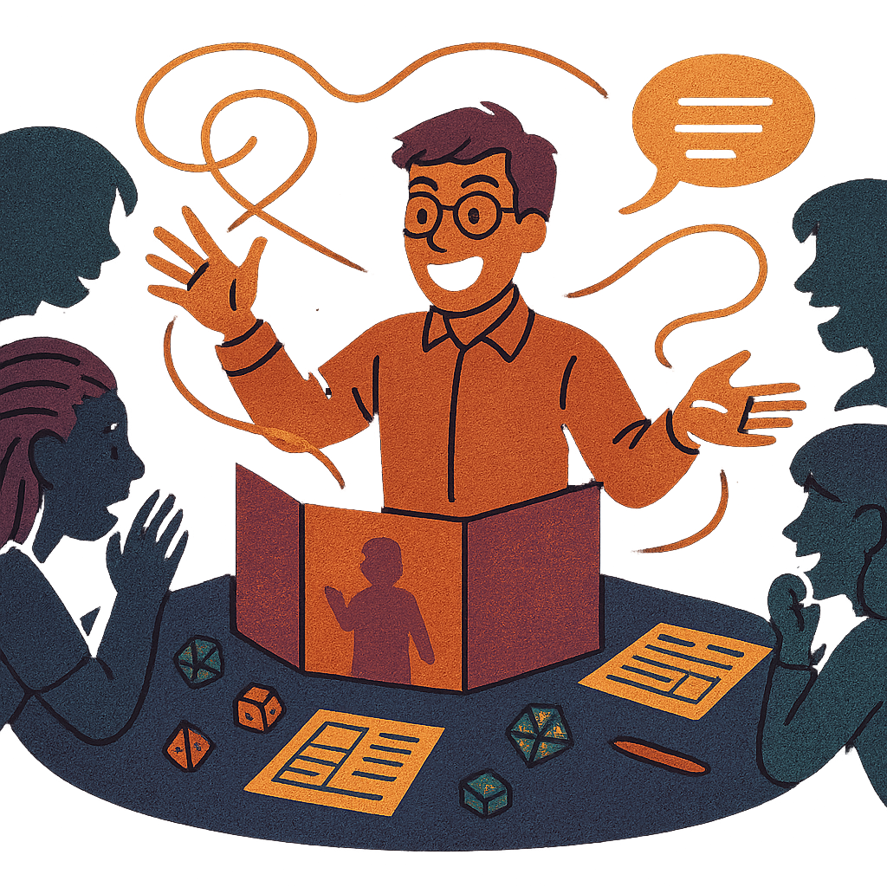{.absolute top=161 left=645 width=370}

::: {.notes}
Research shows narrative structures improve information retention significantly
Stories create stakes - not just "system compromised" but "CFO on phone with angry board"
Technical concepts become real through narrative context
IM adapts story based on player choices, maintains tension
Magic moment: when story pulls players in, real learning happens
Players stop being observers, become participants in unfolding events
:::

##

:::{.absolute style="top:312px;left:265px;width:535px;font-size:58px;color:var(--ink);font-weight:400;text-align:left;line-height:1.2;"}
HackBack  
Tabletop Exercises. The fun kind.
:::

:::{.absolute style="top:434px;left:232px;width:615px;font-size:26px;color:var(--ink);font-weight:400;text-align:left;line-height:1.2;"}
https://www.hackbackgaming.com/  
https://www.linkedin.com/company/hack-back-gaming/  
  

:::

{.absolute top=60 left=427 width=195}

{.absolute top=516 left=475 width=129}

::: {.notes}
So here’s the website and a fancy logo. 
LinkedIn page available
QR code for LinkedIn if too small to sww
Now let’s talk about what it actually is
:::

##

:::{.absolute style="top:178px;left:82px;width:463px;font-size:36px;color:#eeeeee;font-weight:400;text-align:left;line-height:1.2;"}
A general framework for simulating any situation  
  
..also it’s open-source (soon-ish)  

:::

:::{.absolute style="top:61px;left:83px;width:885px;font-size:26px;color:var(--ink);font-weight:400;text-align:left;line-height:1.2;"}
Meet HackBack
:::

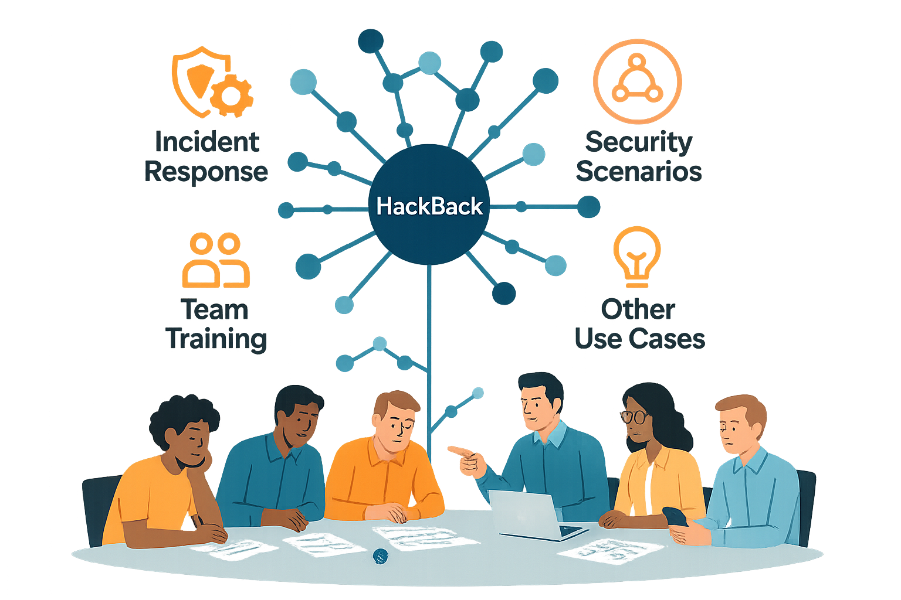{.absolute top=171 left=513 width=489}

::: {.notes}
<CLICK>
Framework can simulate any situation 
Not just IR
<CLICK>
Community-driven development (at least that’s the ambition)
Open source philosophy
Sharing knowledge benefits everyone

Let’s talk about what it can be used for
Before I tell you how to engage and get access to our github repo
:::

##

:::{.absolute style="top:203px;left:67px;width:468px;font-size:35px;color:var(--ink);font-weight:400;text-align:left;line-height:1.2;"}
De-abstractify  
Teaching non-techies  
Teaching teamwork  
Marketing events  
Team events  
Simulating real events
:::

:::{.absolute style="top:61px;left:83px;width:885px;font-size:26px;color:var(--ink);font-weight:400;text-align:left;line-height:1.2;"}
Wide range of applications
:::

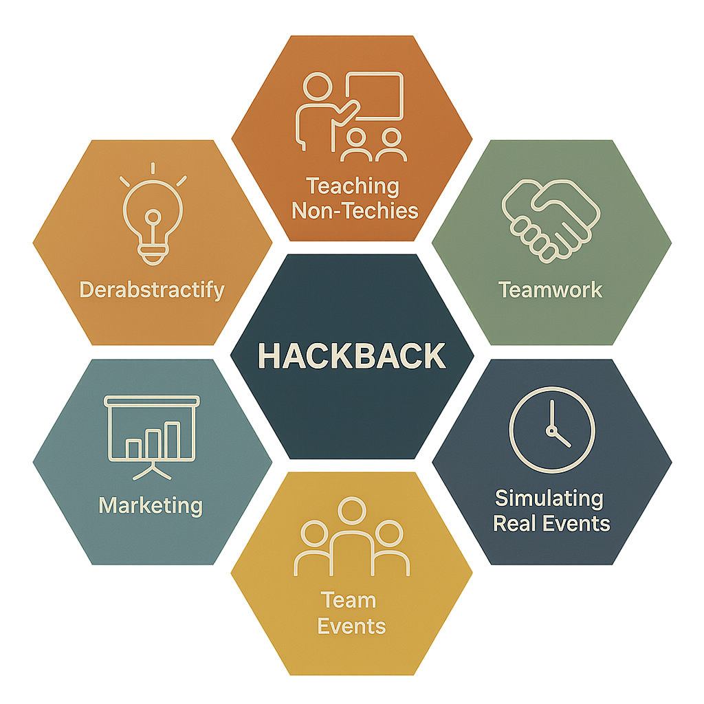{.absolute top=126 left=552 width=439}

::: {.notes}
<DON’T CLICK>
This is truly
Universal power tool you didn't know you needed
These are just examples of usage I could think of.
I’ll bet you’ll be able to find more
<CLICK>
De-abstractify: Zero Trust, IAM concepts concrete
Non-techies: sales/marketing understand hacker thinking or the insides of an incident
Teamwork: 5-person heist, different skills, can't win alone
Marketing events: custom scenarios with your products, customers experience real-world use
Team events: teams play roles, or divided into attack/defense teams
Real events: show stakeholders how you handled past crises

Possibilities are literally endless, just need right idea
:::

##

:::{.absolute style="top:61px;left:83px;width:885px;font-size:26px;color:var(--ink);font-weight:400;text-align:left;line-height:1.2;"}
Scenario Types and Structures
:::

:::{.absolute style="top:161px;left:83px;width:483px;font-size:26px;color:var(--ink);font-weight:400;text-align:left;line-height:1.2;"}
Incident Response (IR):  
Classic defensive response to ongoing attacks  
Offensive Security:  
Red team operations, penetration testing scenarios  
Defensive Security:  
Proactive threat hunting, security architecture design  
Attack and Defense:  
Purple team exercises with competing teams  
Hybrid Scenarios:  
Risk assessment, compliance exercises, business continuity
:::

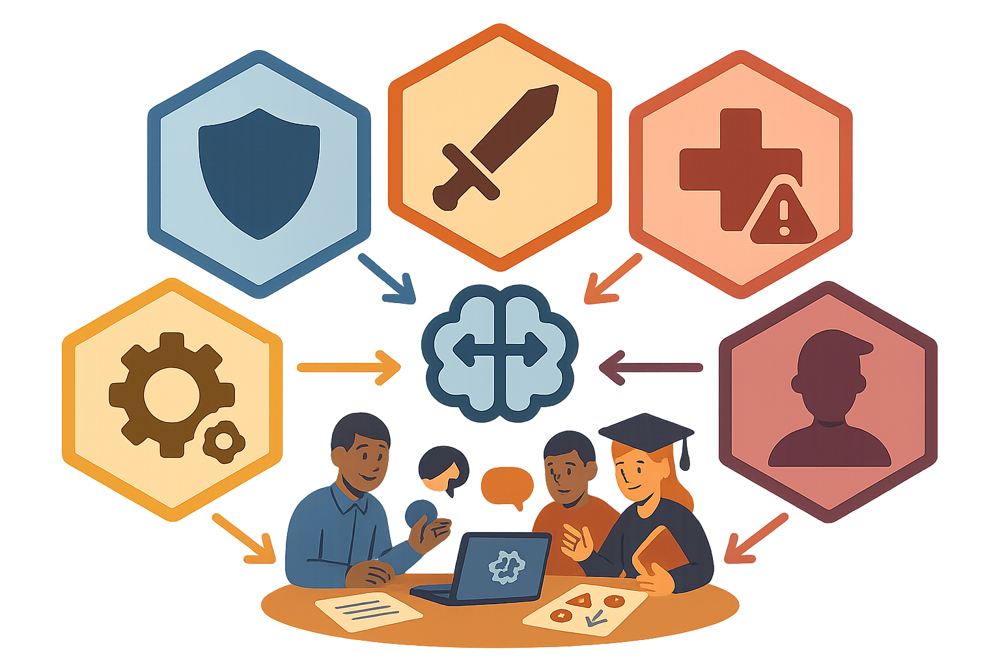{.absolute top=166 left=578 width=441}

::: {.notes}
Let’s go beyond Incident Response
HackBack started with IR but works for any security scenario type
IR: What we just experienced - responding to incidents as they unfold
Offensive: Play as attackers planning and executing operations
Defensive: Proactive security work - building defenses, threat hunting
Attack/Defense: Two teams competing in real-time, like our ransomware example
Hybrid: Risk management (Death Star!), compliance, business scenarios
Each type uses same core mechanics but different objectives and characters
Choose type based on your training goals and audience
Imagination is the only limit
Example: Malware & Monsters - next slide
:::

##

:::{.absolute style="top:185px;left:69px;width:540px;font-size:26px;color:var(--ink);font-weight:400;text-align:center;line-height:1.2;"}
Real malware families.  
Creature-collection mechanics.  
Actual IR skills.  
Hunt threats. Build teams.  
Master  incident response through gameplay.  
Where cybersecurity training meets adventure.
:::

:::{.absolute style="top:61px;left:83px;width:885px;font-size:26px;color:var(--ink);font-weight:400;text-align:left;line-height:1.2;"}
Malware & Monsters
:::

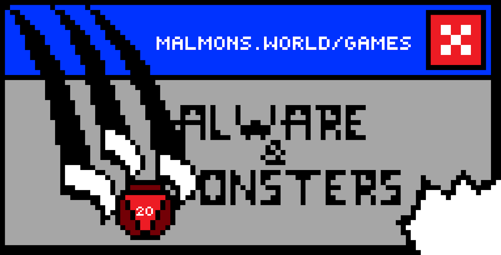{.absolute top=246 left=639 width=343}

:::{.absolute style="top:588px;left:118px;width:813px;font-size:42px;color:var(--ink);font-weight:400;text-align:center;line-height:1.2;"}
https://malmons.world/games
:::

##

:::{.absolute style="top:205px;left:73px;width:497px;font-size:31px;color:var(--ink);font-weight:400;text-align:left;line-height:1.2;"}
Run by Incident Master (IM)  
Team with broad skills  
Each player plays a character  
Actions = roll die  
Open-ended scenarios
:::

:::{.absolute style="top:61px;left:83px;width:885px;font-size:26px;color:var(--ink);font-weight:400;text-align:left;line-height:1.2;"}
Meet HackBack IR Edition
:::

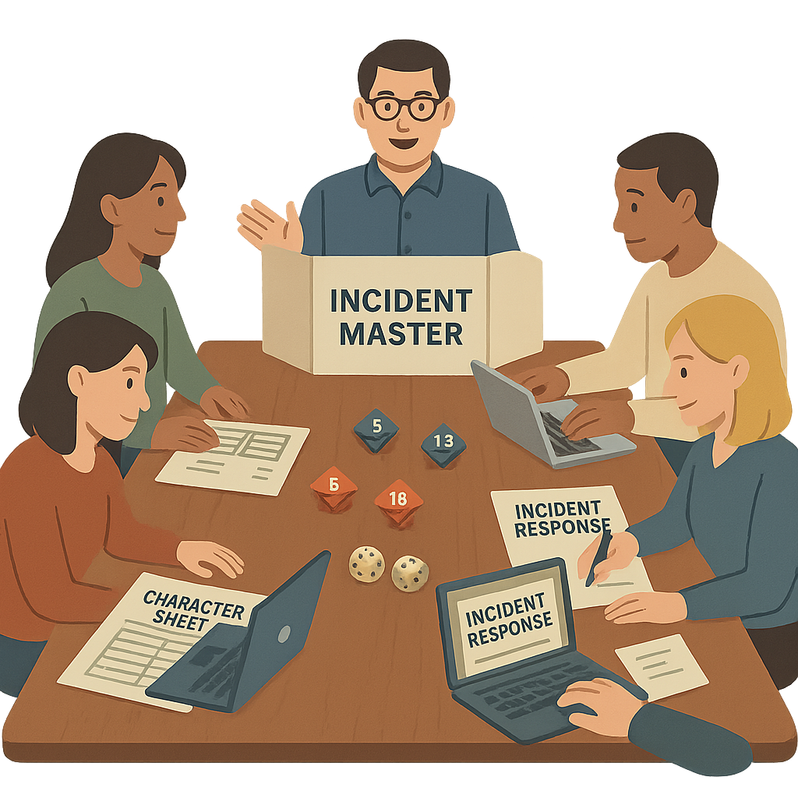{.absolute top=159 left=612 width=370}

::: {.notes}
<DON’T CLICK>
IR = most mature version, where everything started
<CLICK>
Incident Master = ultimate authority, storyteller
IM adjusts difficulty based on players/skill/luck
Ensures key learning objectives reached
Team has broad skills: CMO, CFO, Security manager, IT support, System Architect
Depends on scenario
Each player plays character
When you want to do something, you take an action, roll die 
D20 simulates randomness of reality
Sometimes rthings don't work
Open-ended like real incidents
Little information to start, team investigates
Like real life
:::

##

:::{.absolute style="top:186px;left:83px;width:530px;font-size:41px;color:var(--ink);font-weight:400;text-align:left;line-height:1.2;"}
Modifiers  
Stereotypic, relatable characters  
Getting into character  
Can be challenging  
Real magic happens!
:::

:::{.absolute style="top:61px;left:83px;width:885px;font-size:26px;color:var(--ink);font-weight:400;text-align:left;line-height:1.2;"}
Characters
:::

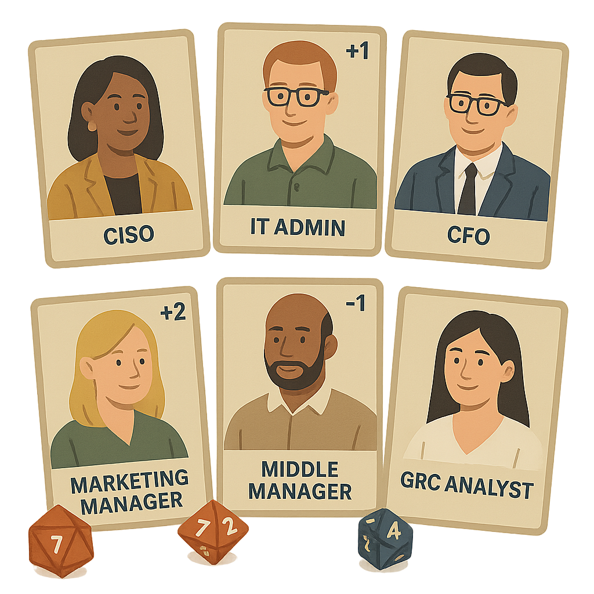{.absolute top=139 left=631 width=375}

::: {.notes}
Modifiers
Characters have strengths/weaknesses
Modifiers added/subtracted from dice rolls
Stereotypical edge makes it fun
Examples: MS System Architect, CFO personalities
Getting into character can be challenging
Fun used as catalyst in beginning of game
Introduction round breaks ice
This is where magic happens
People laugh, immerse, forget to fight scenario
:::

##

:::{.absolute style="top:151px;left:83px;width:552px;font-size:26px;color:var(--ink);font-weight:400;text-align:left;line-height:1.2;"}
Entire IT infrastructure is in MS Azure  
It’s 16:50, Friday (because…)  
Alert from Microsoft DART  
Administrator (from Marketing?!?) logged in.  
Suspicious: Employee is on vacation  
  
What do you do?  
Suggestions?
:::

:::{.absolute style="top:61px;left:83px;width:885px;font-size:26px;color:var(--ink);font-weight:400;text-align:left;line-height:1.2;"}
Example scenario
:::

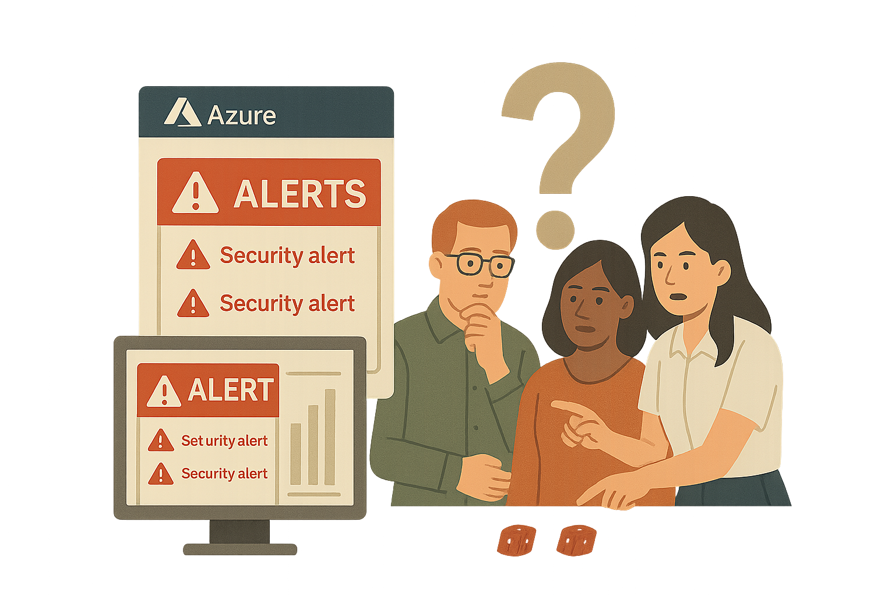{.absolute top=178 left=624 width=378}

::: {.notes}
<DON’T CLICK>
Play for couple minutes as one big team
Show you how it works
<CLICK>
Read loud
Can we deduce anything? Make a decision?
How do we solve this? What information needed?
Once we decide what to do = player rolls D20
Result calculated with modifiers
IM continues storyline based on what happens
Next player takes turn
This is how the game flows
:::

##

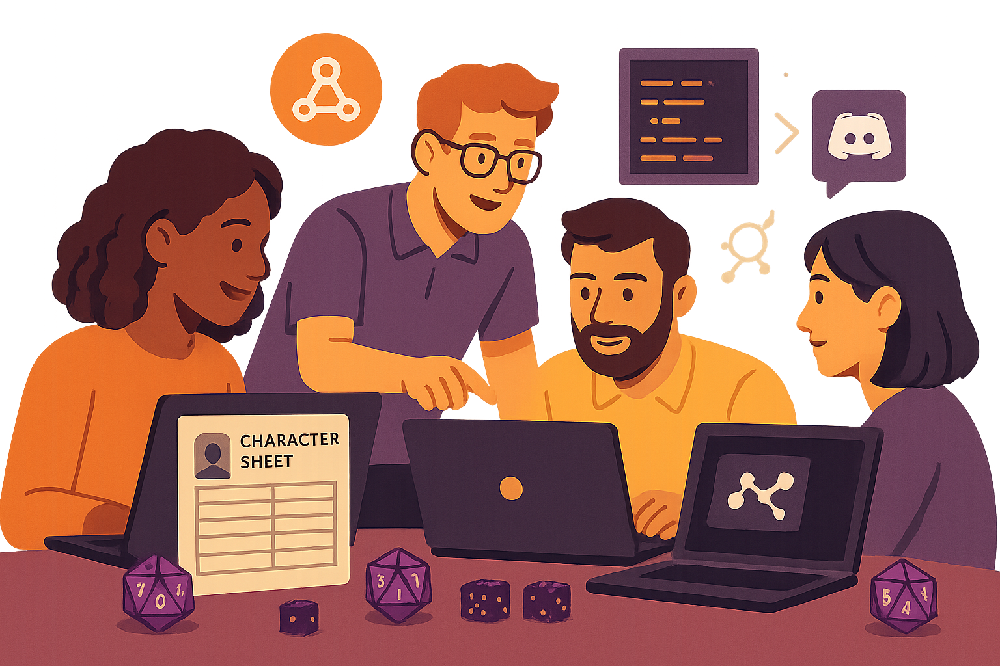{.absolute top=178 left=558 width=458}

:::{.absolute style="top:178px;left:82px;width:476px;font-size:28px;color:var(--ink);font-weight:400;text-align:left;line-height:1.2;"}
Everything is (soon) open source  
mostly Quarto Markdown  
  
Join our Discord server if you want to help out  
  
Sharing is caring
:::

:::{.absolute style="top:61px;left:83px;width:885px;font-size:42px;color:var(--ink);font-weight:400;text-align:left;line-height:1.2;"}
Let’s all join the same guild on this!
:::

::: {.notes}
Everything in private Github repo for now
We’ll open source when it’s more useable
Quarto Markdown primarily
Join Discord to help out
Ping me for Github access
Encourage people to improve game
Share with everyone else
Community-driven development
Sharing is caring philosophy
:::

##

:::{.absolute style="top:139px;left:74px;width:454px;font-size:29px;color:var(--ink);font-weight:400;text-align:left;line-height:1.2;"}
We had plans..  
  
Premade characters  
3 scenarios (not quite there)  
IM guidance  
Handouts  
Rules  
IM handbook (in the works)  
  
Ready for use! (...with a bit of help..)
:::

:::{.absolute style="top:61px;left:83px;width:885px;font-size:26px;color:var(--ink);font-weight:400;text-align:left;line-height:1.2;"}
State of HackBack
:::

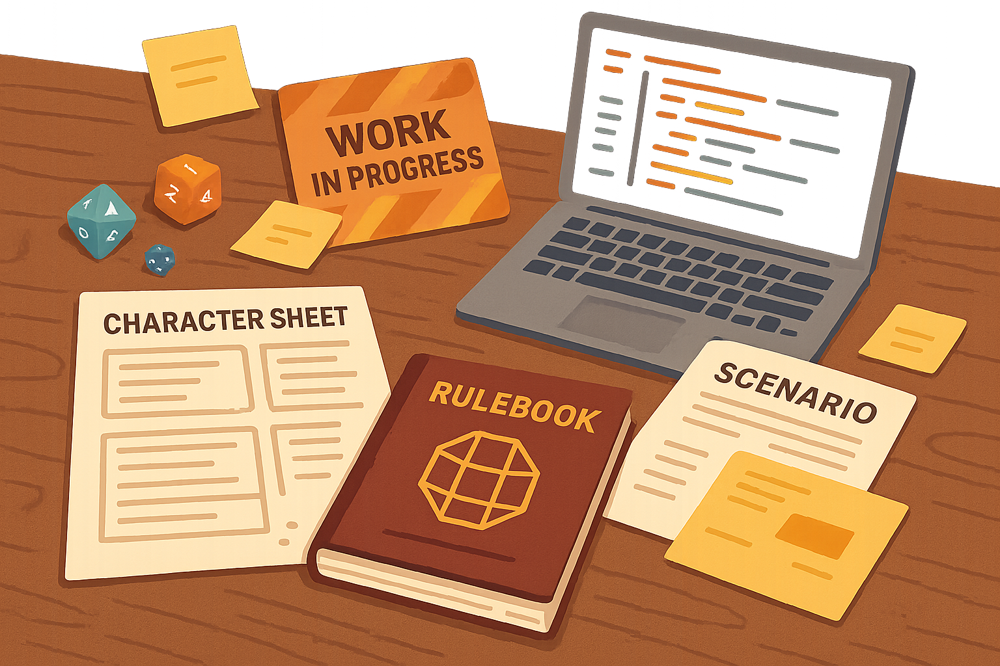{.absolute top=164 left=543 width=471}

::: {.notes}
We had plans. Then reality struck 
(turns out we hate writing documentation)
What we do have is:
Characters
Three scenarios + IM guidance (somehow) + handouts
Rules documented (somehow)
Handouts 
Can be played if you get help (would love to!)
Started filling gaps and improving with Claude Code
Please help out - long list of issues to collaborate on
:::

##

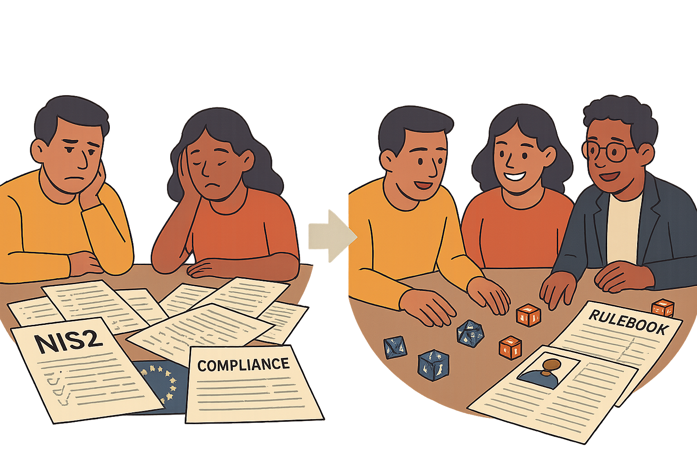{.absolute top=142 left=183 width=644}

:::{.absolute style="top:349px;left:83px;width:885px;font-size:54px;color:var(--ink);font-weight:400;text-align:center;line-height:1.2;"}
Why not make it fun and engaging?
:::

:::{.absolute style="top:61px;left:83px;width:885px;font-size:50px;color:var(--ink);font-weight:400;text-align:left;line-height:1.2;"}
Doing NIS2 (like anyone else)?
:::

::: {.notes}
<DON’T CLICK>
Doing NIS2 (or other compliance stuff)?
IR training required
<CLICK>
Here's chance to hit two birds with one stone!
Do IR training this way
Have fun AND meet compliance reqs
Make users love compliance (well, sort of)
(also if you do this, your colleagues don’t hate you)
:::

##

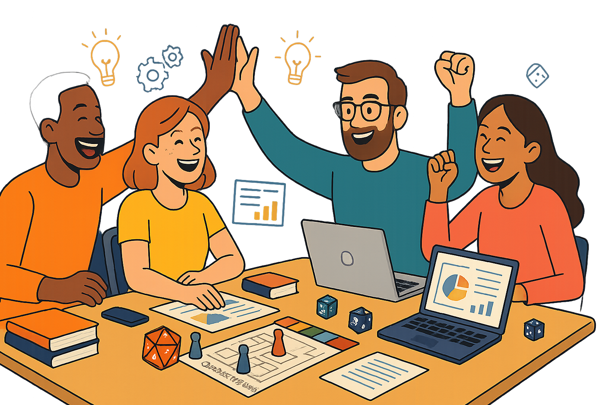{.absolute top=180 left=257 width=537}

:::{.absolute style="top:267px;left:194px;width:633px;font-size:51px;color:var(--ink);font-weight:400;text-align:left;line-height:1.2;"}
Remember:  
Have fun and learn!
:::

::: {.notes}
<DON’T CLICK>
Core message of entire presentation
<CLICK>
Learning through engagement
Fun is not unserious and should not be looked down upon - it's effective!
Would love to hear what you want to do with HackBack
What you've done when you try it
Community contribution welcome
Looking forward to receiving your PRs (pull requests)
:::

##

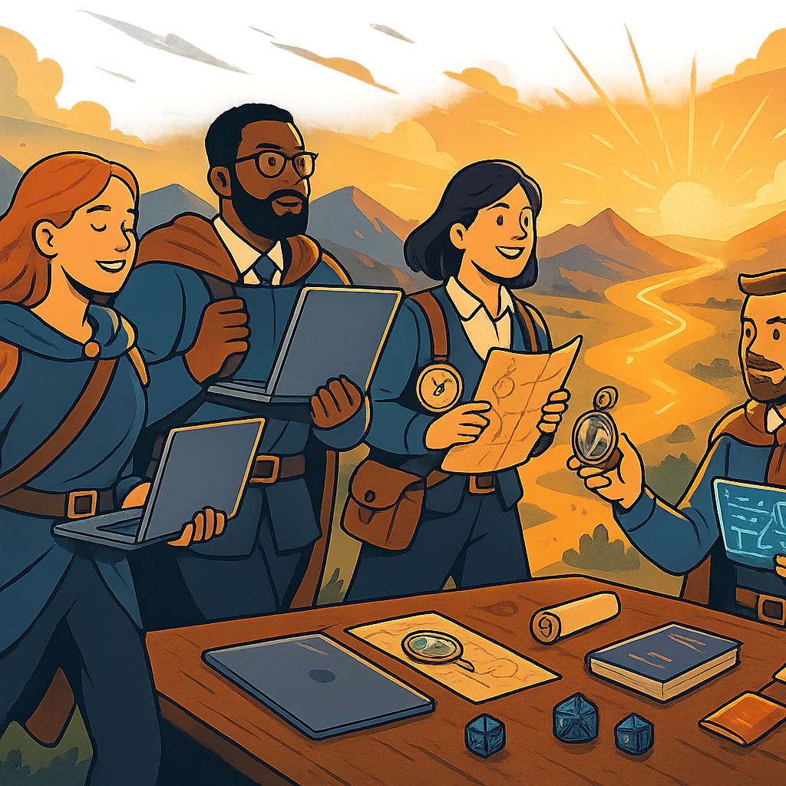{.absolute top=73 left=252 width=556}

:::{.absolute style="top:227px;left:125px;width:800px;font-size:54px;color:var(--ink);font-weight:400;text-align:left;line-height:1.2;"}
Who's ready to turn their next security drill into an adventure?  
  
Awesome! Get in touch!  

:::

::: {.notes}
<DON’T CLICK>
One more thing before we go (except showing off cool animations)
<CLICK>
If we've inspired you - want to do this at work
Awesome!
If you have decision power and budget
Even more awesome!
If not, get in touch anyway
Happy to help convince your boss
:::

##

:::{.absolute style="top:61px;left:293px;width:477px;font-size:26px;color:var(--ink);font-weight:400;text-align:left;line-height:1.2;"}
Thanks!
:::

{.absolute top=569 left=150 width=44}

:::{.absolute style="top:553px;left:190px;width:407px;font-size:20px;color:var(--ink);font-weight:400;text-align:left;line-height:1.2;"}
https://www.linkedin.com/in/agnoletti/  
https://www.linkedin.com/in/glen-sorensen/
:::

{.absolute top=569 left=618 width=58}

:::{.absolute style="top:44px;left:277px;width:509px;font-size:80px;color:var(--ink);font-weight:400;text-align:center;line-height:1.2;"}
Questions?
:::

:::{.absolute style="top:553px;left:671px;width:325px;font-size:20px;color:var(--ink);font-weight:400;text-align:left;line-height:1.2;"}
klaus@relationssec.net  
glen.sorensen@protonmail.com
:::

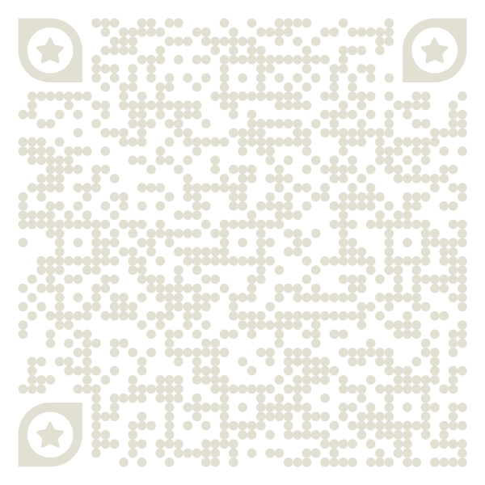{.absolute top=166 left=364 width=336}

::: {.notes}
Thanks!
Have any questions?
Scan the QR code to download slides
Please get in touch if you have questions, commons, want to play, whatever
:::

