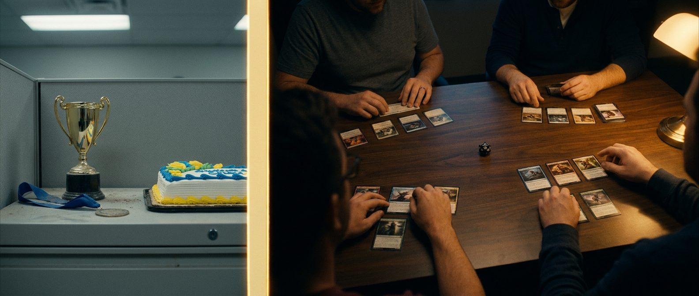
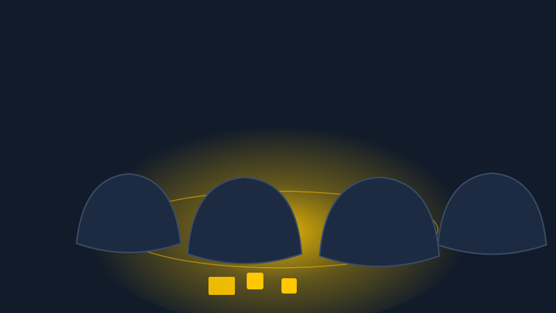
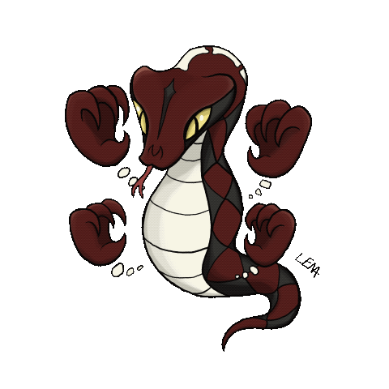
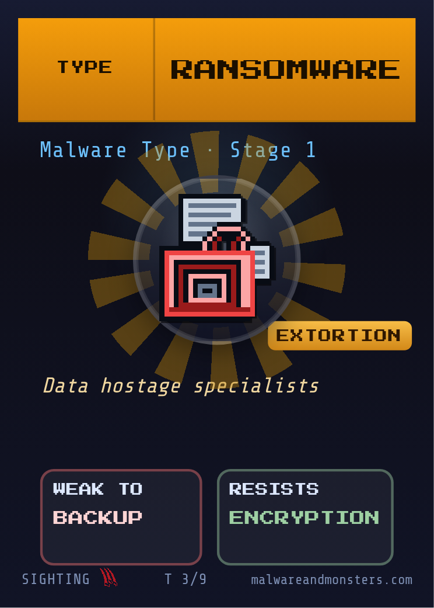
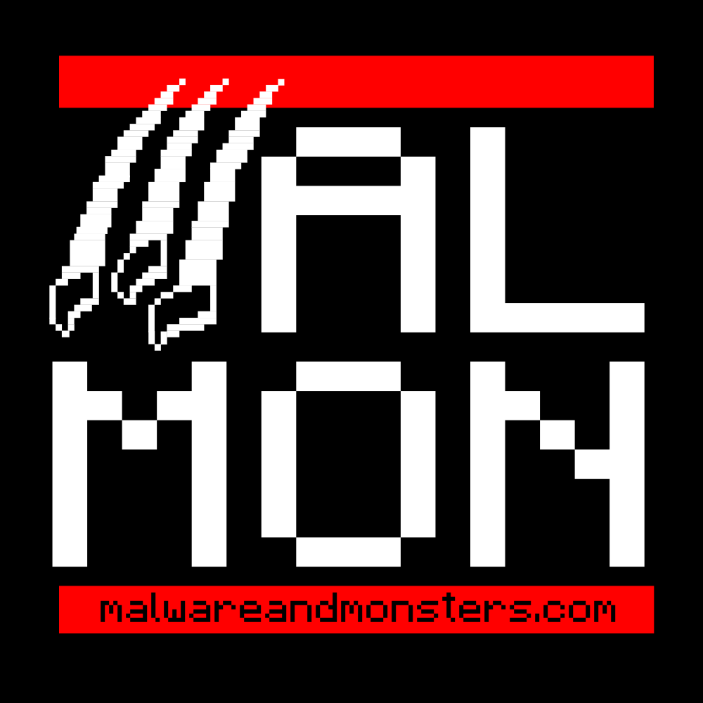

## {.cover .bg-drift}

::: {.lockup}
[Incident [Response Training]{.accent}]{.title}

[From response plan to muscle memory]{.subtitle}
:::

::: {.byline}
Klaus Agnoletti · Dansk IT · 9 September 2026
:::

::: {.notes}
- Silent, on camera. Carlos runs welcome + scripted intro (his card, anonymized clients)
- Nod at TV2 / DEF CON mentions, nothing more
- Never "30 years in infosec"
:::

## {background-image="images/klaus-cats.jpg" background-size="cover" background-position="center"}

::: {.notes}
- 30-45s max, icebreaker tone, before anything else starts
- Chat: "If you have black cats or dogs at home, put it in the chat."
- Copenhagen; wife + two cats, we took in off the street, siblings, both black
- 20 years in IT security
- Short on the career: consultant in vulnerability management, advisory, and incident response → founder of KbhSEC → creator of Malware & Monsters
- Bridge straight into the cold open, no "and now for today's topic"
:::

## {.vcenter background-image="images/hero-december-desk.jpg" background-opacity="0.4" background-size="cover"}

[December. An email from the butcher.]{.hero-line}

::: {.notes}
- Memorized 90s, in medias res, no "back when I made a documentary"-preamble
- Beats: municipality · cheap Christmas meat · Christmas gift-basket raffle · people click
- The link is DEAD → they troubleshoot it, ask colleagues, try again
- Slow down on: they troubleshoot the attacker's link FOR him
:::

## {.vcenter background-image="images/hero-december-desk.jpg" background-opacity="0.18" background-size="cover"}

[Everyone clicks. The question is what happens after.]{.hero-line style="font-size:2.4em;"}

::: {.notes}
- Pause before advancing, let it sit 2s
- This is the frame for the entire hour
- It's not realistic to expect that anyone always spots a phishing attempt. Not even me. And especially not now, when AI makes it cheap to run large-scale targeted phishing.
:::

## When did you last PRACTICE your incident response plan? {.vcenter}

::: {.feature-grid style="--fg-cols:4;"}
- A: Under 1 year
- B: 1–3 years
- C: Over 3 years
- D: Don't know
:::

```{=html}
<div class="join"><div class="join__code"><span class="join__url">wooclap.com</span><span class="join__key">SRCIDYA</span></div></div>
```

::: {.notes}
- Say the code twice, slowly: "wooclap dot com, S R C I D Y A". Leave it up a full 30s, the stream runs 20 to 60s behind you.
- BEFORE 14:00: deck opened via `bash dit_ir_webinar_2026/serve.sh` at http://localhost:8765 (NOT the file, the Wooclap frames are blank from file://). Logged in to Wooclap in this browser, "Start event" clicked once, the projected screen (QR + code) open in its own tab. Early joiners see "no vote in progress", fine.
- When this slide is up: push question 1 to their phones, arrow right in the Wooclap tab. Phones show no tally; the chart appears on the next slide by itself ("display answers automatically" is ON).
- Next slide shows the result. React unscripted, ONE sentence, whatever it is.
- ABORT: if the join page is not live, this becomes a rhetorical question: "Hands up in your own head. Most rooms land on D."
- D is the honest answer for most rooms, say so warmly if D wins
- Fallback if it lands oddly: "What goes wrong in an incident is rarely that people don't know enough. It's that they're certain of something wrong, and manage to act on it."
:::

## {.vcenter}

```{=html}
<div class="poll-frame live-frame" data-live-src="https://app.wooclap.com/events/SRCIDYA/questions/6aa106b94026bc4e3711b685" data-live-title="Live poll result"></div>
```

::: {.notes}
- Question 1 chart, live. If it shows a login, log in inside the frame once (done in the pre-show test, holds for the day). Code showing instead of a chart = alt-tab to the Wooclap tab.
- D is the honest answer for most rooms, say so warmly if D wins
- Bridge into the spine, name what just happened: "Notice what I just did. I asked what you'd SAY. The butcher's email showed what people DO."
:::

## {.vcenter .lattice}

::: {.card style="text-align:center; max-width:640px; margin:0 auto;"}
[SAY ≠ DO]{style="font-family:'Bebas Neue',sans-serif; font-size:2em; letter-spacing:0.03em; color:var(--accent);"}
:::

::: {.notes}
- Verbatim: "Surveys tell you what people SAY they'd do. An exercise shows you what they DO. That's what this hour is about."
- One observable, so the survey point is never bare: "DO is something you can time. How many minutes from the first strange call to the moment someone with a mandate is on the line."
- Contract, what they get, not what we cover: "You'll play one round yourselves, vote on a real decision, and leave with a free guide you can run with your own team next week."
- Callback target for the SAY ≠ DO close after Q&A, identical words
:::

## An exercise can also end up as SAY. {.vcenter}

::: {.card style="text-align:center; max-width:640px; margin:0 auto;"}
Not WHETHER you practice. HOW.
:::



::: {.notes}
- So the question isn't whether you practice. It's whether the exercise changes what people DO.
- A slideshow read aloud with a signature at the end is SAY with extra steps.
- Same trap in phishing tests: the click rate is a dial. Whoever writes the test sets the difficulty, so the number measures the tester, not the staff.
- Gotcha tests cost trust, and one click is enough anyway. Back to the butcher: the interesting part starts AFTER the click.
- ~35s, master frame for the next ten minutes
:::

## IT is not a cost. IT is a precondition. {.vcenter}



::: {.notes}
- Verbatim: "Many organizations don't see themselves as IT companies. They see IT as a cost to be kept down, not as the precondition for everything else they do. So leadership aims for the lowest possible security. Right up until the first ransomware attack."
- Beat of pause after "ransomware attack", then straight into compliance: the cost mindset is WHY orgs do the NIS2 minimum
- ~45s
:::

## NIS2 · ISO 27001: Practice is MANDATORY. The format isn't. {.vcenter}

::: {.feature-grid style="--fg-cols:4;"}
- People don't open up
- Egos clash
- "It can't happen here"
- Fun is taboo
:::



::: {.notes}
- Compliance as diagnosis, ONCE, here, never again
- Chain: boring → no engagement → no learning → no point
- Payoff, flat, unsold: people who hate exercises spend all their energy finding fault with the exercise; make it engaging and they forget to resist
- The duty creates the obligation; the game turns the obligation into competence
:::

## The plan only lives on paper. {.vcenter background-image="images/hero-dead-document.jpg" background-opacity="0.35" background-size="cover"}

::: {.notes}
- Response plan from five years ago, lives in SharePoint
- Ransomware hits, there's no SharePoint
- "You shouldn't throw the plan out. The exercise is what gets the plan living in people's heads instead of in SharePoint."
:::

## {.vcenter}

::: {.bignum}
Pulse 200. IQ&nbsp;50.
:::



::: {.notes}
- In the middle of an incident, your pulse shoots up to 200, and your IQ crashes to 50.
- What you've PRACTICED is all you've got.
- That's not the moment to invent a new process from scratch.
- It takes two things: that you've trained for it, and that you have a playbook that actually works.
- Few words. Clear images. Not twenty dense pages.
- It needs to be skimmable at three in the morning, when it's on fire.
- That's why the plan needs to be PRACTICED, not read.
:::

## {.vcenter .lattice}

::: {.divider}
WHY IS THIS TRAINING DIFFERENT?
:::

::: {.notes}
- Breathe here, closes the whole training-theater critique section
- Nothing to say on this slide, let the question sit 2s and advance
:::

## {.vcenter}

::: {.card style="text-align:center; max-width:640px; margin:0 auto;"}
[INSTINCT.]{style="font-family:'Bebas Neue',sans-serif; font-size:2em;"} [Not information.]{style="font-family:'Bebas Neue',sans-serif; font-size:2em; color:var(--muted);"}
:::



::: {.notes}
- A format that can't produce instinct isn't training. It's information.
- You don't learn security by reading about it. You learn it by making decisions under pressure. Games, stories, simulation.
- Callback: "What you've PRACTICED is all you've got" (the Pulse 200 slide), this slide names WHY that's true
- Plant the closer here, verbatim: "Engagement isn't decoration. It's the mechanism. A format nobody engages with teaches nothing. That's why fun matters, and I'll come back to that."
- Bridge: "And that's why the FORMAT matters. Not gamification. Game-based learning."
:::

## {.vcenter}

::: {.feature-grid style="--fg-cols:2;"}
- Gamification: points, badges, cake
- Game-based learning: the game IS the learning
:::

::: {style="width:100%; max-width:940px; margin:0.7em auto 0;"}
{style="width:100%; height:auto; display:block; border-radius:var(--radius); box-shadow:var(--shadow);"}
:::

::: {.notes}
- Verbatim: "This isn't gamification: points, badges, and 'first team done gets cake'. Motivation theater. The game itself is what teaches you something."
- No citation on the slide; Gee/Simkins stay pocketed for Q&A
- Must land BEFORE any mechanics are shown
:::

## You're scored on your reasoning. Not on the right answer. {.vcenter}



::: {.notes}
- The promise before any mechanics: nobody is graded on guessing the true state. You're graded on how you reasoned with what you had.
- One clause, max. This is what makes it safe to be wrong at the table, and safe to say "I'm not sure" out loud.
- Callback target for the live vote later
:::

## An incident has many seats {.vcenter}



::: {.notes}
- The six M&M roles, one click each: Detective, Protector, Tracker, Communicator, Crisis Manager, Threat Hunter
- Technical people overlook the soft seats (Communicator, Crisis Manager), they decide whether the organization keeps a level head
- Non-technical welcome: a method, not a specialty
- Many of you KNOW what needs doing; the hard part is translating that for leadership
- Rhetorical, answer it yourself: "How many roles does your plan have? For most of you, two. IT, and whoever signs. An incident has six."
- Straight into "Think with a head that isn't yours"
:::

## Think with a head that isn't yours {.vcenter}

::: {.feature-grid style="--fg-cols:2;"}
- The attacker's
- Your colleague's
:::



::: {.notes}
- Attacker clause kept light, one sentence
- The technician plays Communicator → empathy for that seat under pressure
- Resilience: what if the person who always takes X is out sick that day? That's why roles rotate
:::

## If kids can play it … {.vcenter background-color="#111B2A"}

::: {style="width:100%; max-width:760px; margin:0.4em auto;"}
{style="width:100%; height:auto; display:block;"}
:::

::: {.notes}
- A nonprofit in Seattle trains kids on my framework, summer camp, beginner scenario
- Reassurance: if kids can, so can your crisis team; it's just about tuning the scenario
- Punchline IS the pivot, verbatim: "… so can your crisis team. Now we do it."
:::

## {.vcenter .spotlight}

::: {.card style="text-align:center; max-width:640px; margin:0 auto;"}
[ONE ROUND. THEN IT'S YOU.]{style="font-family:'Bebas Neue',sans-serif; font-size:1.5em;"}
:::



::: {.notes}
- One round narrated (Klaus plays all seats), so everyone sees the shape once
- [POINT] Detective first, doubt-first d20 on the first claim
- Then the room decides live, on a new incident
- Don't try to track every rule, watch for confidence vs evidence
:::

## MALWARE & MONSTERS {.vcenter}

::: {.kicker}
malwareandmonsters.com
:::

::: {.chip-note}
Analog · 3–8 players + one Incident Master
:::

::: {.feature-grid style="--fg-cols:3;"}
- 1 · What is it?
- 2 · How bad?
- 3 · Contain
:::

::: {style="width:100%; max-width:310px; margin:0.4em auto 0;"}
{style="width:100%; height:auto; display:block;"}
:::

::: {.notes}
- Three rounds, verbatim: "What are we looking at? How bad is it? Containment."
- The IM isn't a player; the IM runs the scenario
- [POINT] "This one is GaboonGrabber, the first malmon ever. A trojan that dresses up as a legitimate software update."
- Malmons (~25s): malware "personified" as creatures, makes something abstract concrete
- Containment, NEVER "and then we fix it"
- Forward-pointer: "…and if there are fifteen of you, there's a variant of the same game. I'll come back to that."
:::

## {.vcenter background-color="#05070c"}

:::: {.columns style="align-items:center;"}
::: {.column width="55%"}
::: {.bignum}
03:20
:::
:::
::: {.column width="45%"}

:::
::::

::: {.feature-grid style="--fg-cols:3;"}
- 3 alerts
- 1 strange screen
- 2 of 3 wrong
:::

::: {.notes}
- Read as IM, in character: "You're the Communicator. It's 03:20. Monitoring has sent three alerts in 40 minutes. One user has called in about a strange screen. You know three things, and two of them are wrong. You just don't know which two."
- Never a clean "it's ransomware" label
:::

## {.vcenter}

::: {.feature-grid style="--fg-cols:2;"}
- Tracker: firewall logs, NOW
- Communicator: wake leadership … or wait?
:::



::: {.notes}
- Both real decisions, only ONE involves a die
- Why: pulling logs is an action in the world, so it can fail: roll. Deciding whether to call is talking: free. That distinction is the next slide.
- Character-color line (~10s, cut-first if running long): the characters are deliberately stereotyped; the intro round is where strangers stop performing competence
:::

## Talking is free. Acting costs a roll. {.vcenter}

:::: {.columns}
::: {.column width="60%"}
::: {.feature-grid style="--fg-cols:2;"}
- Doubt? Roll
- Success: cleaner trail
- Failure: muddier trail
- Never the answer
:::

::: {.feature-grid .fragment .fx style="--fg-cols:3; font-size:0.55em; margin-top:0.2em;"}
- Easy: 5+
- Medium: 10+
- Hard: 15+
:::
:::
::: {.column width="40%"}

:::
::::

::: {.notes}
- Open with the thesis: "Talking is free. Acting costs a dice roll. And what you did beforehand loads the die."
- Free doesn't mean irrelevant. The talking is exactly what you're scored on. The die only decides how clean the trail ends up.
- Doubt-first: no doubt = it just succeeds, no roll
- Bands on click: "Easy needs 5 or more, medium 10, hard 15. Ask a good question first and the IM drops it a band. That's how what you did beforehand loads the die."
- Success example: "the log shows a certificate error and encrypted traffic to an unknown IP", cleaner, still incomplete
- NEVER CUT this beat
:::

## THE PRESUMPTION DECK {.vcenter}

::: {.presumption-cards}
{.fragment .fx}
{.fragment .fx}
{.fragment .fx}
:::

::: {.notes}
- Round 1 ends: each card is placed FACE DOWN, what do I think this is, and how confident am I?
- Cards are flipped SIMULTANEOUSLY
- Agreement + high confidence: play continues. A split table, or one person confident and wrong: the game STOPS, what did you SEE, what did you ASSUME?
- Say it out loud, this is the pairing: "That confidence card is the number your questionnaire is trying to measure. Here it's measured against what actually happened."
- Then next slide. Do not talk over the flip.
:::

## {.vcenter}

::: {.card style="text-align:center; max-width:700px; margin:0 auto;"}
[Confident. Wrong. Followed.]{style="font-family:'Bebas Neue',sans-serif; font-size:1.5em;"}
:::



::: {.notes}
- [SILENCE 3s] after the line, nobody fills it
- Verbatim, slow: "The worst thing that can happen is being totally confident about something that's wrong, and everyone else following along, because you seem sure."
- Seattle callback (~15s): even the kids spent their first energy on finding WHO clicked, instead of solving the incident
- Culture bridge: "What you should take home isn't just 'be less certain'. It's: create a space where it's safe to say 'I'm not sure' out loud, before reality forces you to."
:::

## A wrong theory costs time. {.vcenter}



::: {.notes}
- Setup, verbatim: "A wrong theory doesn't lose the game. It costs time."
- Close the round with the consequence, concrete: "This table played Ransomware, Confident. It was credential theft. Round 2 they spent twenty minutes restoring backups while the attacker still had the domain admin account."
- The table's conclusion, right or wrong, IS the working theory in round 2
- Exactly like reality
- Bridge: "That was one round. Now it's you."
:::

## Monday 08:40 {.vcenter}

::: {.feature-grid style="--fg-cols:5; font-size:0.5em;"}
- Encrypted files on the shared drive
- Backup: unverified
- Backup admin on parental leave
- Citizen services opens 09:00
- The mayor has already called
:::



::: {.notes}
- 45s read, stakes language, the mayor, not the server
- Straight into the poll, no meta-talk
:::

## What do you do NOW? {.vcenter}

::: {.feature-grid style="--fg-cols:3;"}
- A: Pull the cable
- B: Isolate the file server
- C: Call leadership first
:::

::: {.chip-note .pulse-cue}
wooclap.com · SRCIDYA · 30 seconds
:::



::: {.notes}
- Push question 2 to their phones now: arrow right in the Wooclap tab. Same code as before, say it once.
- Verbatim: "Don't think. First instinct, one letter. The stream runs behind me, so I'll wait." Then click: the ring starts. Count 20, 10, 5 yourself.
- No tally during the 30s. Next slide reveals.
- ABORT: join page dead = "Pick one in your head. Hold it." and go straight to the prices.
:::

## {.vcenter}

```{=html}
<div class="poll-frame live-frame" data-live-src="https://app.wooclap.com/events/SRCIDYA/questions/6aa1086aa3e3f5575beff39f" data-live-title="Live vote result"></div>
```

::: {.notes}
- Question 2 chart, live. Code showing instead of a chart = alt-tab to the Wooclap tab.
- Reveal, react to the room's split in one sentence, then the price of each, these are scenario facts not session data:
- A pulled the cable: encryption stops on that host. You keep the disk and the logs. What you lose is the live picture, so in round 2 you can't say whether they're still inside anywhere else.
- B isolated the file server: you contained the spread, not the source. Round 2 you still don't know how they got in, and someone tells citizen services at 09:00 anyway.
- C called leadership first: the decision now has a signature. Round 2 it's 09:25, the mayor has an opinion, and the drive has been encrypting for 45 minutes.
- Landing: "All three are defensible. None is free. Whoever chose A has to say it out loud to whoever chose B."
- Trap, spoken: "Nobody chose 'wait for more information'. Good. That's also a choice, and its price is the drive still encrypting while you wait."
- Verbatim: "You don't get to avoid the loss. You get to pick which one you can defend at 09:00."
- Landing line: "Everyone here formed an opinion in thirty seconds. At a real table you have to defend it out loud. To the citizens standing in Citizen Services at nine o'clock."
- Callback: "And remember, you're scored on the reasoning. Not on the letter."
:::

## What an exercise measures. {.vcenter}

::: {.feature-grid style="--fg-cols:2;"}
- Time to escalate
- Who got called
- Decisions on half the facts
- Confidence vs outcome
:::



::: {.notes}
- Verbatim: "This is what an exercise measures. A questionnaire can't."
- This is the replacement evidence, the thing you hand leadership INSTEAD of the questionnaire
- Each one is observed, not stated: a clock, a phone log, a card on the table
- The last one is the presumption card, they've just seen it
- Structured debrief, 5 to 20 minutes, is where these get written down. That's the artifact.
- Starter guide: free, malwareandmonsters.com, full CTA waits till the end
:::

## Free. No email gate. {.vcenter}

::: {style="width:100%; max-width:260px; margin:0 auto 0.8em;"}
{style="width:100%; height:auto; display:block;"}
:::

::: {.feature-grid style="--fg-cols:3;"}
- Starter guide
- Scenario cards, your level
- Ready in 90 minutes
:::

::: {.notes}
- Verbatim: "Free. No email gate. You can run the first round next week."
- 58 scenario cards across 14 malmon families
- This starter guide is what the QR code at the end points to
- OPTIONAL: if time and screen-share are behaving, advance to the live site (next slide, uncounted). If not, skip straight to Q&A.
:::

## The free starter guide, live {.vcenter visibility="uncounted"}

```{=html}
<div class="browser">
<div class="browser__bar"><span class="browser__dot"></span><span class="browser__dot"></span><span class="browser__dot"></span><span class="browser__url">https://malwareandmonsters.com</span></div>
<div class="browser__body live-frame" data-live-src="https://malwareandmonsters.com" data-live-title="malwareandmonsters.com" data-live-fade="1"></div>
</div>
```

::: {.chip-note}
The actual site, not a mockup.
:::

::: {.notes}
- [30 SEC MAX] Tab is pre-warmed. One sentence, cursor to the nav, click straight to the starter guide, then back. No general scrolling.
- Say: "This is the actual site. Starter guide, 3 to 8 colleagues, 90 minutes."
- Fallback if the page is slow or dead: "Trust me, it's live, the link's in chat." Carlos pastes the URL. No troubleshooting on stream.
- OPTIONAL live tour, ~60-90s: homepage → starter guide → a scenario card. Skip if anything is flaky.
- Focus gotcha: mouse clicks go to the SITE, use keyboard to advance slides, click the slide edge first if arrows stop responding
- Site shows a first-visit welcome popup ("New to Malware & Monsters?") — dismiss it (X or "Leave me alone") the instant it appears, before narrating
- REHEARSE this transition, including the popup dismiss
:::

## QUESTIONS? {.vcenter background-image="images/hero-december-desk.jpg" background-opacity="0.14" background-size="cover"}

::: {style="text-align:center; color:var(--accent); font-family:'Bebas Neue',sans-serif; font-size:1.2em;"}
malwareandmonsters.com
:::

::: {.notes}
- Carlos runs it, seeded order:
- (1) NIS2/ISO fit → the duty already exists; this is the format that turns duty into competence
- (2) how technical do you need to be → a method, not a specialty
- (3) does it scale? → repeated small tables OR a large-group format (12-15 across three teams), anonymized example, never session content
- For those caught between GRC and operations: I've also made a small card deck, the Risk Deck, that gives technically-minded security people a language for risk, business impact, and business jargon. One breath.
- Self-answered: "How do you get started?" → free starter guide, 3-8 colleagues, 90 minutes. CTA-priming: "…and if you'd rather have a facilitated first session than build the exercise yourselves, that exists too."
- Pocket answers: wrong guess in round 1 · key person absent (role-keyed clues) · evidence (Frontiers + Gee + Simkins) · "can it test our REAL plan?" (a different format, against your BCP)
- Carlos cuts Q&A at 14:54 no matter what: the three closing slides plus the Monday chat ask need five minutes
:::

## {.vcenter .lattice}

::: {.card style="text-align:center; max-width:640px; margin:0 auto;"}
[SAY ≠ DO]{style="font-family:'Bebas Neue',sans-serif; font-size:2em; letter-spacing:0.03em; color:var(--accent);"}
:::

::: {.notes}
- [CARLOS hands back, one breath, then:]
- Verbatim, identical to the opening: "Surveys tell you what people SAY they'd do. An exercise shows you what they DO."
- Short pause. "You saw the difference yourselves. Right there, in the vote. Thirty seconds, half the facts, and an opinion."
:::

## MONDAY MORNING {.vcenter}

::: {.feature-grid style="--fg-cols:3;"}
- 1: Starter guide, this month
- 2: Run it with your REAL crisis team
- 3: Put it in the annual exercise plan
:::



::: {.notes}
- First ask: "Type 1, 2 or 3 in the chat. Which one are you doing Monday?" Carlos reads the spread.
- Transfer check, verbatim: "And write one more thing: did what you just saw make you think 'WE should fix this', or 'I need to fix this'? That difference is the whole point."
- Rung 3 = pure commitment, NO scale claim here (lives in seeded Q3)
- Budget angle, one line on rung 2: "Run it once with the real team and leadership sees the gap themselves. That does more for next year's budget than any report."
:::

## {.vcenter}

::: {.hero-line style="max-width:900px; text-shadow:none;"}
Fun isn't unserious. It's effective.
:::

<div style="background:#F8F8FA; border-radius:var(--radius); width:190px; margin:0.7em auto 0.4em; padding:8px; box-shadow:var(--shadow);"></div>

::: {style="text-align:center; color:var(--accent); font-family:'Bebas Neue',sans-serif; font-size:1.2em;"}
malwareandmonsters.com
:::

::: {.notes}
- Final spoken line, then stop: "…And one last thing: fun isn't unserious. It's effective."
- Slide stays up through goodbye
:::
