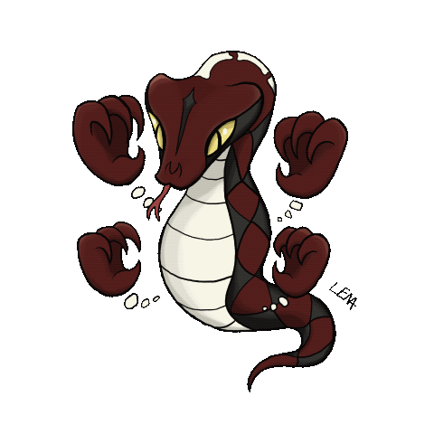

---

## Who am I? {data-background-image="images/who-am-i.png" data-background-size="cover" data-background-position="center"}

::: {.notes}
- [45s MAX. Lead with the two beats that earn credibility: 20 years in security, and I built a free IR game. The rest only if time. Do not let the bio eat the room's freshest minutes.]
- "If you have black pets..."
- Copenhagen; wife + two shelter cats (brother/sister, both black)
- 20 years in security
- Internal, external consultant, security architect at several companies
- Career turn into marketing; head of community at open-source security co until Dec 2022
- Back into advisory: freelance to help companies get secure
- Community-focused marketing for companies that want marketing that people actually care about
- "Spoiler: there aren't many of those, strangely enough"
- Always had a thing for games + security learning
- Here to convince you to do the same
- No photos needed; QR code on last slide
:::

---

## BSides København 2026

**14 November 2026** | Bella Center

Call for speakers is **open** until 15 August.

Scan to submit on Sessionize.

::: {.notes}
- Quick plug for my home community: BSides København
- Next edition: 14 November 2026, Bella Center
- CFP is open now, closes 15 August
- [POINT TO QR] scan to submit a talk on Sessionize
- Link is also on their LinkedIn and Twitter (@bsideskbh)
:::

---

## The requirement is real {data-background-color="#0033FF"}

<svg viewBox="0 0 1060 360" style="width:980px;max-width:94%;height:auto;display:block;margin:14px auto 0;" xmlns="http://www.w3.org/2000/svg" font-family="Terminal, Courier New, monospace"><rect x="24" y="24" width="230" height="66" rx="10" fill="none" stroke="#ffffff" stroke-width="3"/><text x="139" y="68" text-anchor="middle" fill="#ffffff" font-size="32" font-weight="bold">NIS2</text><rect x="24" y="147" width="230" height="66" rx="10" fill="none" stroke="#ffffff" stroke-width="3"/><text x="139" y="191" text-anchor="middle" fill="#ffffff" font-size="32" font-weight="bold">DORA</text><rect x="24" y="270" width="230" height="66" rx="10" fill="none" stroke="#ffffff" stroke-width="3"/><text x="139" y="314" text-anchor="middle" fill="#ffffff" font-size="32" font-weight="bold">ISO 27001</text><rect x="716" y="105.0" width="320" height="150" rx="10" fill="#ffffff" stroke="#ffffff" stroke-width="3"/><text x="876" y="159" text-anchor="middle" fill="#0033FF" font-size="30" font-weight="bold">Run incident</text><text x="876" y="190" text-anchor="middle" fill="#0033FF" font-size="30" font-weight="bold">response</text><text x="876" y="222" text-anchor="middle" fill="#0033FF" font-size="30" font-weight="bold">exercises</text><line x1="254" y1="57" x2="712" y2="179" stroke="#ffffff" stroke-width="4"/><polygon points="712,179 694,183 699,166" fill="#ffffff"/><line x1="254" y1="180" x2="712" y2="180" stroke="#ffffff" stroke-width="4"/><polygon points="712,180 696,189 696,171" fill="#ffffff"/><line x1="254" y1="303" x2="712" y2="181" stroke="#ffffff" stroke-width="4"/><polygon points="712,181 699,194 694,177" fill="#ffffff"/></svg>

::: {.notes}
- **Point** at the three names as you say them
- Pause - let the weight land
- *"You already know this. The question is what you are actually running."*
- ~30s
:::

---

## The problem is not the requirement

The problem is attendance.

::: {.incremental}
- You close the calendar invite
- The chase begins
- Half the room has a conflict
- You reschedule twice
- You run it anyway: four people, one laptop
:::

::: {.notes}
- Pause after first line
- Rhythm: slow build on bullet list - each one a recognizable failure
- *"This is not a compliance failure. This is a training failure disguised as a compliance problem."*
- ~2 min total on this slide + next
:::

---

## Fix the boring problem

When people actually want to show up:

::: {.incremental}
- You stop chasing calendars
- You get full rooms
- The exercise runs at real depth
- The compliance box closes itself
:::

[*People show up when it is worth showing up for.*]{.fragment}

::: {.notes}
- [LET THE SLIDE CARRY THE LINE] then say it your way: not a nice-to-have, it is the mechanism
- [PAUSE] let it sit
- **Transition**: *"So. What does that actually look like?"*
- Keep the problem section (this slide + the previous one) to ~3 min combined. This is the PROBLEM beat; the engagement-as-training argument lands later at "Fun lowers the guard", so do not pre-argue it here. If long, cut the bullet list, keep the punchline
:::

---

## What is Malware & Monsters? {data-background-image="images/malmon-logo.png" data-background-size="contain" data-background-color="#000000"}

::: {.notes}
- Section 2 starts here - 8-10 min total
- Breathe - new section beat
:::

---

## A free tabletop role-playing game for incident response

One twenty-sided die.
Defined roles.
An Incident Master running the table.

*Discussion is free. Actions roll.*

::: {.notes}
- Say each line clean and separate, let them land
- *"No prep. No rules knowledge needed to play."*
- *"The IM is you. You run the table."*
- [IF THE CARD IS NOTICED] *"This is one malmon. Today we fight a different one."*
:::

---

## The roles

| Role | Owns |
|------|------|
| **Detective** | Triage, forensics, timelines |
| **Tracker** | Network traffic, C2, lateral movement |
| **Threat Hunter** | Threat intel, hunting, attribution |
| **Protector** | Containment and isolation |
| **Crisis Manager** | Coordination and the hard calls |
| **Communicator** | Stakeholders and comms |

::: {.notes}
- Read roles fast: names only, skip descriptions unless someone asks
- *"In a real incident you have all six of these conversations. Here they have names."*
- The floated card is the Communicator; the rest are in the handbook
:::

---

## How a round works

<svg viewBox="0 0 620 470" style="width:780px;max-width:92%;height:auto;display:block;margin:6px auto 0;" xmlns="http://www.w3.org/2000/svg" font-family="Terminal, Courier New, monospace">
<line x1="352.1" y1="104.6" x2="407.7" y2="145.0" stroke="#55A9FF" stroke-width="3"/><polygon points="407.7,145.0 393.7,143.7 402.2,132.1" fill="#55A9FF"/>
<line x1="444.2" y1="232.6" x2="423.0" y2="298.0" stroke="#55A9FF" stroke-width="3"/><polygon points="423.0,298.0 419.8,284.4 433.5,288.8" fill="#55A9FF"/>
<line x1="350.9" y1="359.8" x2="282.1" y2="359.8" stroke="#55A9FF" stroke-width="3"/><polygon points="282.1,359.8 294.1,352.6 294.1,367.0" fill="#55A9FF"/>
<line x1="201.1" y1="310.4" x2="179.8" y2="245.0" stroke="#55A9FF" stroke-width="3"/><polygon points="179.8,245.0 190.4,254.2 176.7,258.6" fill="#55A9FF"/>
<line x1="201.8" y1="152.6" x2="257.4" y2="112.2" stroke="#ED1C24" stroke-width="3.5"/><polygon points="257.4,112.2 251.9,125.1 243.5,113.4" fill="#ED1C24"/>
<text x="214.9" y="101.1" fill="#ED1C24" font-size="18" font-weight="bold" text-anchor="middle">evolves</text>
<text x="310" y="226" fill="#666" font-size="15" text-anchor="middle">ONE</text>
<text x="310" y="246" fill="#666" font-size="15" text-anchor="middle">ROUND</text>
<circle cx="310.0" cy="74.0" r="52" fill="#262626" stroke="#55A9FF" stroke-width="2.5"/>
<text x="310.0" y="79.0" fill="#e8e8e8" font-size="16" text-anchor="middle">Describe</text>
<circle cx="460.3" cy="183.2" r="52" fill="#262626" stroke="#55A9FF" stroke-width="2.5"/>
<text x="460.3" y="188.2" fill="#e8e8e8" font-size="16" text-anchor="middle">Discuss</text>
<circle cx="402.9" cy="359.8" r="52" fill="#262626" stroke="#55A9FF" stroke-width="2.5"/>
<text x="402.9" y="364.8" fill="#e8e8e8" font-size="16" text-anchor="middle">Commit</text>
<polygon points="217.1,308.9 265.6,344.1 247.1,401.1 187.2,401.1 168.7,344.1" fill="#262626" stroke="#7fffd4" stroke-width="2.5"/>
<text x="217.1" y="357.8" fill="#7fffd4" font-size="16" font-weight="bold" text-anchor="middle">Roll</text>
<text x="217.1" y="375.8" fill="#888" font-size="12" text-anchor="middle">d20</text>
<circle cx="159.7" cy="183.2" r="52" fill="#262626" stroke="#55A9FF" stroke-width="2.5"/>
<text x="159.7" y="188.2" fill="#e8e8e8" font-size="16" text-anchor="middle">Narrate</text>
</svg>

::: {.notes}
- Tap through the steps - one beat each
- **Pause at step 5** - *"The IM narrates. The dice set the stakes. The team lives with the result."*
- *"The malmon is the incident. It evolves if you fail to contain it in time."*
:::

---

## Fully documented

Everything at **malwareandmonsters.com**

- Player handbook
- IM handbook
- Malmon cards
- Pre-built scenarios

::: {.notes}
- Quick slide, don't linger
- [SAY THE URL] *"Everything is at malwareandmonsters.com. I will come back to it at the end."*
- Transition: *"Before we play, I want to show you one thing about why this works."*
:::

---

## Why engagement is the mechanism {data-background-color="#0033FF" .divider}

::: {.notes}
- Section 3 - 8-10 min total
- This is the argument section - stay measured, not salesy
:::

---

## Fun lowers the guard

Stop performing competence.
Start **thinking out loud**.

::: {.notes}
- [SLOW DOWN] let "thinking out loud" land
- *"That is the only state where learning actually lands."*
- *"In a tabletop exercise, people protect their position. In a game, they argue. Those arguments are the training."*
:::

---

## The calibration problem {data-auto-animate=true}

Not *not knowing*.

[**Certain.**]{.fragment} [**Wrong.**]{.fragment} [**Too fast.**]{.fragment}

::: {.notes}
- *"Most of what goes wrong is not a knowledge gap."*
- **Say the three words hard**, one beat each
- [PAUSE]
- *"We added a mechanic to make that explicit."*
:::

---

## Before you roll, show a card {.center data-auto-animate=true}

Blind and simultaneous

<table class="calib" style="border-collapse: collapse; font-size: 0.44em;">
<tr>
<td></td>
<td style="padding: 4px 16px; color: #888;">WRONG</td>
<td style="padding: 4px 16px; color: #888;">RIGHT</td>
</tr>
<tr>
<td style="padding: 8px 14px; color: #888; text-align: right;">CONFIDENT</td>
<td class="fragment" data-fragment-index="3" style="background: #ED1C24; color: #fff; padding: 12px 20px; font-weight: bold; text-align: center;">WORST</td>
<td class="fragment" data-fragment-index="1" style="background: #0033FF; color: #fff; padding: 12px 20px; text-align: center;">best</td>
</tr>
<tr>
<td style="padding: 8px 14px; color: #888; text-align: right;">UNSURE</td>
<td class="fragment" data-fragment-index="2" style="background: #333; color: #ccc; padding: 12px 20px; text-align: center;">ok</td>
<td class="fragment" data-fragment-index="2" style="background: #1f4a2f; color: #fff; padding: 12px 20px; text-align: center;">ok</td>
</tr>
</table>

::: {.notes}
- **Hold up physical card** if you have one: CONFIDENT
- *"The type card is what you are trying to identify. The confidence card is your blind call on it."*
- *"Blind and simultaneous: no one anchors on the senior voice in the room."*
- [POINT TO THE RED CELL] *"Confident and wrong: the worst outcome. Because that is the actual failure mode."*
- *"Unsure and wrong barely costs you. The game pays for calibration, not confidence."*
- *"That is not a game rule. That is incident response."*
- Say last line clearly and then pause, this is the section's exit beat
- ~60s on this slide
:::

---

## Let's play {data-background-color="#0033FF" .center}

::: {.notes}
- Section 4 - 20-25 min total
- **Check the clock** - should be around 25-30 min in at this point
- Shift energy - stand up straight, project voice
- *"I need a favour from everyone. You are the incident response team for a finance company. I am your Incident Master."*
:::

---

## Tuesday morning

> It's Tuesday morning. EDR flags a single finance workstation beaconing to an unfamiliar host. The analyst identifies it as TrickBot - a banking trojan and loader. One machine, one user, contained to the finance VLAN as far as you can tell. The user is mid-quarter-close and screaming that they need the machine back.

**What does your team do first?**

::: {.notes}
- [NAME THE STAKE FIRST] *"You are the IR team at Nordhavn Finans. Quarter-close is in three days. The CFO already does not trust security."*
- Read the brief exactly as written, no improv
- **Show of hands (action)** *"Hands up: isolate now. Observe and scope. Loop in leadership first."*
- Name the split in rough fractions out loud: *"Half isolate, a third observe, a handful escalate. We disagree. That is exactly right."*
- 75s floor discussion, then call a decision
- [ANNOUNCE THE TARGET] *"You need 10 or higher to cut it clean."* Hand the d20 to a front-row volunteer to roll for the room
:::

---

## R1 - First contact

Isolate now / Observe and scope / Loop in leadership first

::: {.notes}
- [THE RIGGED CALIBRATION BEAT, nail this one] before the action vote, ask: *"Quick gut call: is TrickBot just a banking trojan, or a loader that pulls down other malware? Fist = sure it is just a banker. Palm up = unsure."* Most commit confident-banker. They are about to be wrong.
- **Pre-scripted outcomes** (pick by the roll; let the roll move a VISIBLE stake):
  - *Isolate, roll 10+:* "C2 cut. It staged on ONE host before you pulled it." → R2
  - *Isolate, roll <10:* "TrickBot saw it coming. Staged on THREE hosts anyway." → R2
  - *Observe, roll 10+:* "C2 captured, still in recon. Staged on one host." → R2
  - *Observe, roll <10:* "It saw the watch, went quiet, staged on three." → R2
  - *Escalate, any roll:* "Leadership looped in, clock managed, box untouched. Loader staged on three." → R2
- **End every R1 outcome with:** *"While you worked, TrickBot acted as a LOADER and staged ransomware."*
- [HARVEST THE MISS] *"Thirty seconds ago most of you were sure it was just a banker. It just loaded ransomware. That, right there, is confident and wrong."* Point at the red WORST cell.
- **ROUND PLAN: spine is R1, R3, R5. Insert R4 only if 6+ min remain. Never plan on all five.**
:::

---

## R2 - Payload staged

> TrickBot pulled down ransomware - staged but not yet detonated on three finance VLAN hosts.

Cut the VLAN / Surgical removal host by host / Invoke DR and tell the business now

::: {.notes}
- This is the cuttable round (redundant with R1's contain-vs-observe). In the R1/R3/R5 spine you SKIP it; play only if well ahead on time
- If played: 60s, action hands, name the split in fractions out loud, commit, announce the target, audience volunteer rolls
- Narrate outcome → bridge to R3: *"One host starts encrypting."*
:::

---

## R3 - Encryption starts

> One host starts encrypting. The other two haven't fired yet.

Cut power to all three / Let the one run isolated to understand scope / Tell the business before they discover it

::: {.notes}
- Same cadence: action hands, name the split in fractions, commit, **announce the target out loud**, audience volunteer rolls
- Make the dice move a visible stake again (how many hosts encrypt on the roll)
- Bridge: if 6+ min remain go to R4, else jump straight to R5
- *"TrickBot signatures outside the finance VLAN."* (R4) or *"Thirty-six hours later."* (R5)
:::

---

## R4 - Scope expands

> TrickBot signatures on two hosts outside the finance VLAN, including an HR server with employee data.

Expand the perimeter / Contain silently and confirm / Trigger mandatory breach notification now

::: {.notes}
- GRC vs. red team split is sharpest here, the best disagreement beat: protect this round over R3 if you must cut
- Mine the minority: *"You voted against the room. What do you see that they don't?"*
- Bridge to R5: *"Thirty-six hours later."*
:::

---

## R5 - Recovery decision

> 36 hours in, ransomware detonated. Backups exist but are 3 days old and potentially dirty. Business wants a timeline.

Restore from potentially dirty backups / Rebuild from scratch (2-week timeline) / Pay the ransom

::: {.notes}
- This one generates the most heat, the ransom option is live and divisive: the right closer
- If good play meets a bad roll: *"The call was sound, the dice were not. That happens in real incidents. That is the point."*
- Roll, narrate, then straight to the debrief
:::

---

## However far we got {.center}

<table class="calib" style="border-collapse: collapse; font-size: 0.4em;">
<tr>
<td></td>
<td style="padding: 4px 12px; color: #888;">WRONG</td>
<td style="padding: 4px 12px; color: #888;">RIGHT</td>
</tr>
<tr>
<td style="padding: 7px 12px; color: #888; text-align: right;">CONFIDENT</td>
<td style="background: #ED1C24; color: #fff; padding: 11px 16px; font-weight: bold; text-align: center;">WORST</td>
<td style="background: #0033FF; color: #fff; padding: 11px 16px; text-align: center;">best</td>
</tr>
<tr>
<td style="padding: 7px 12px; color: #888; text-align: right;">UNSURE</td>
<td style="background: #333; color: #ccc; padding: 11px 16px; text-align: center;">ok</td>
<td style="background: #1f4a2f; color: #fff; padding: 11px 16px; text-align: center;">ok</td>
</tr>
</table>

Same room. Same facts. Genuine disagreement at every step.

That is incident response.

The game does not tell you which call is right.
It makes you commit to one and live with the dice.

*The cards make that gap visible before the outcome settles it.*

[**In your last real incident: were you ever confident, and wrong? When?**]{.fragment}

::: {.notes}
- The three lessons were already said live (confident-and-wrong at R1, the split each round, no right answer). This slide is a RECAP, not a first delivery
- [POINT TO THE GRID] *"You raised confident thumbs at R1. You were wrong before the dice even rolled."*
- [ASK THE QUESTION, then let it hang in silence] do not answer it for them
- 3-4 min, don't rush
:::

---

## Start running it yourself {data-background-color="#0033FF" .center}

::: {.notes}
- Section 5 - 5 min
- Energy shift: practical, close-out
:::

---

## That gap has a name

That gut-drop when you were sure and wrong: **Sighting** scores exactly that.

It is on the site.

::: {.notes}
- Name what they FELT, do not introduce a new feature: *"That gut-drop when you were sure and wrong? There is a scoring layer built to train exactly that out. It is called Sighting."*
- *"It makes calibration scorable. It is on the site."*
- [PAUSE] then bridge: *"So here is what I am actually asking you to do."*
:::

---

## Everything is free

**Download. Print. Run it with your team.**

malwareandmonsters.com

Join the Discord. That is where the community runs new scenarios.

::: {.notes}
- [POINT TO URL] say it out loud: *"malwareandmonsters.com. No account. No paywall."*
- *"Download, print, play. Run it with your team next month, not next year."*
- [POINT TO QR] *"Scan it. The community runs new scenarios there."*
- *"Run it. Tell us how it went. That is the whole ask."*
- [PAUSE] then: *"Two quick things before we wrap."*
:::

---

## BSides Pyongyang 2026

bsidespyongyang.myshopify.com

::: {.notes}
- [GRIN] the running gag has merch now
- bsidespyongyang.myshopify.com
- Light beat, let the room enjoy it, then move on
:::

---

## Sticker swap booth

**Free stickers. All conference.**

Bring some, take some.

Donations to charity welcome. MobilePay QR at the booth.

::: {.notes}
- I am hosting a sticker swap booth all day
- Stickers are free, take what you like
- Bring your own to swap
- MobilePay QR codes at the booth for a charity donation, or bring your own
- Come say hi
:::

---

## Questions

Klaus Agnoletti
klaus@relationssec.net
malwareandmonsters.com

Find me at the sticker booth all day.

::: {.notes}
- Open for questions
- *"Thank you."*
- Contact is on screen; I am at the sticker booth all day
:::
