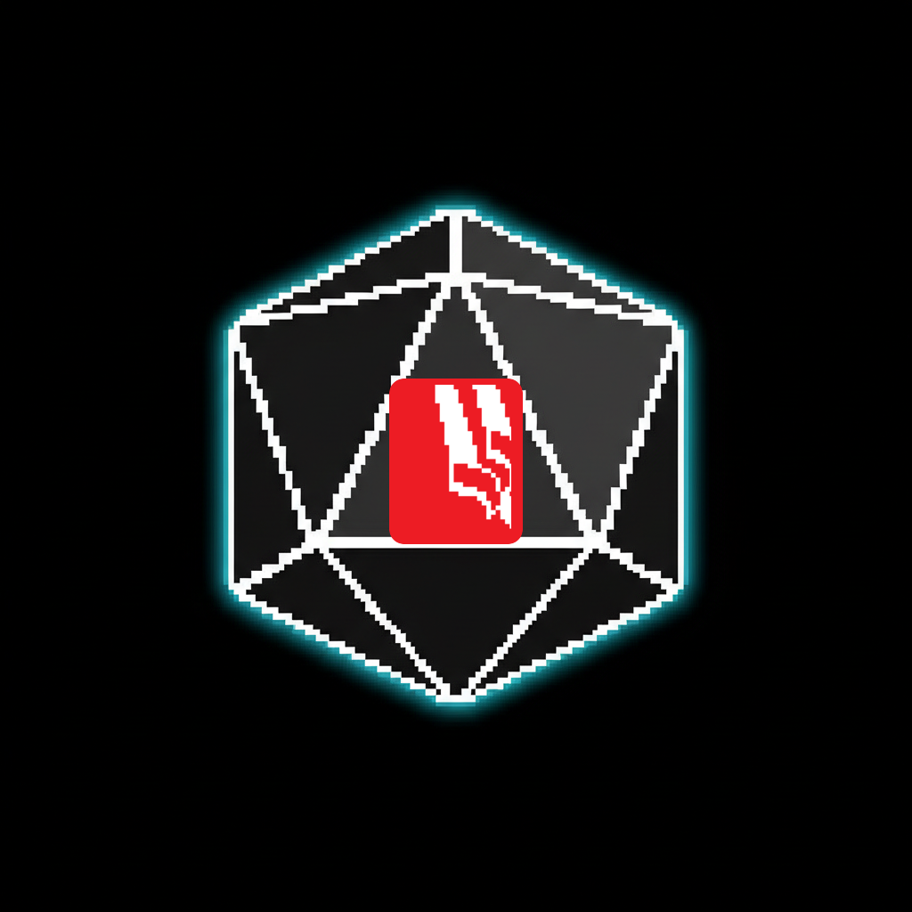

---

## The incident nobody rehearses {.vc}

Escalate?
Notify the regulator?
Disclose to customers?
Brief the board?

[Decided by management, on a summary, under a clock.]{.fragment .punch}

::: {.notes}
- [BUILD the four pills one beat each] these are the calls that decide the outcome
- *"None of them are technical. All of them are made by the people in this network."*
- [PAUSE] *"And almost every exercise rehearses the SOC, not this room."*
- Ronald may add: this is what he saw missing in retainers
- Transition: *"So we rehearse this layer."*
:::

---

## Tabletops tick the box {.vc data-auto-animate=true}

Standard tabletop

Script read cold

Half the room has a conflict

Once a year

Nobody is wrong

::: {.notes}
- [FAST] everybody here has sat in this
- *"NIS2, DORA and ISO all demand an exercise. So the box gets ticked."*
- Do not dwell; the morph on the next slide does the work
:::

---

## A room that argues {.vc data-auto-animate=true}

Standard tabletop

Script read cold

Half the room has a conflict

Once a year

Nobody is wrong

Malware &amp; Monsters

Live decisions, consequences land

People come back

Runs in an afternoon, repeatable

Wrong calls surface, safely

::: {.notes}
- [LET THE MORPH LAND, then point right]
- *"The world pushes back. A containment call can fail. A notification can be late. The room feels it."*
- *"The arguing between the CISO and the head of comms about the 72 hours: that argument IS the training."*
- Keep it to outcomes; no mechanics, no dice, no cards
- If asked how: *"a facilitator, a scenario, tables of five, decisions under uncertainty."* Stop there.
:::

---

## Already run inside KPMG {.vc}

Hacknet 2026

Utrecht · KPMG NL community · June

KPMG Bootcamp

Sofia · 15 in the room · 8 Sept

Utrecht

KPMG evening session · 9 Sept

[Plus BSides and security teams across Europe]{.fragment .muted}

::: {.notes}
- [HAND TO RONALD] he was in the room; his read beats yours
- Ronald's own words, 28 Aug: *"something else than boring tabletops"*
- Sofia lesson, said openly: *"the tech room loved it; the regulatory people needed a different scenario. That is what the next slide is."*
- Do not oversell numbers; three real rooms is the point
:::

---

## Scenarios for this room {.vc}

CRA

Product risk

Ship, patch or disclose?

NIS2

The 24 hours

Early warning on what you know now?

DORA

Third-party ICT

Your provider is the incident

Board

Management call

Pay, restore or wait?

::: {.notes}
- [BUILD one tile at a time, one sentence each]
- CRA: a vulnerability in your own product, the reporting duty vs the release train
- NIS2: early warning with incomplete facts; the regulator wants something in 24h
- DORA: the incident is at your provider; what do you control, what do you report
- Board: ransomware; the executive decision with legal, comms and finance in the room
- Honest line: *"The GDPR notification scenario exists today. The CRA and DORA tracks are built for this audience; you help shape them."*
- No technical detail. Every scenario here is a management decision.
:::

---

## What a member takes home {.vc}

1Decisions rehearsed before they are real

2Gaps written down, owners assigned

3A team that turns up for the second session

::: {.notes}
- *"The output is a written debrief: decisions made, gaps found, follow-ups assigned."*
- Do NOT claim audit or regulator acceptance; say *"the shape of evidence your programme already needs"* and stop
- Point 3 is the differentiator; Ronald has seen it
:::

---

## How it runs {.vc .has-side}

<b>90 minutes</b> to a half day

<b>Tables of five</b>, one facilitator

<b>Zero prep</b> for participants

<b>EU-native</b>, no product, no logos

::: {.notes}
- [FAST, 30s] facts only; Ronald and Courtney own where it fits in i-4
- *"Independent practitioner. Nothing to sell you afterwards."*
- If asked about the picture: *"that is the only game piece you will ever see from me."* Move on.
:::

---

## Run one. Small. Under your rules. {.vc .has-side}

[One session for one group of members]{.fragment}

[KPMG Netherlands fronts, Klaus facilitates]{.fragment}

[malwareandmonsters.com](https://malwareandmonsters.com)

::: {.notes}
- [THE ASK, say it plainly] *"Give me one room of members. Ronald's team fronts it. You judge it on the debrief."*
- Then stop talking. Let Neil respond.
- If they want a bigger stage: *"the forum is the prize; a roundtable is how we earn it."*
- [Q&A] Ronald takes KPMG-fit questions; you take concept questions
:::
