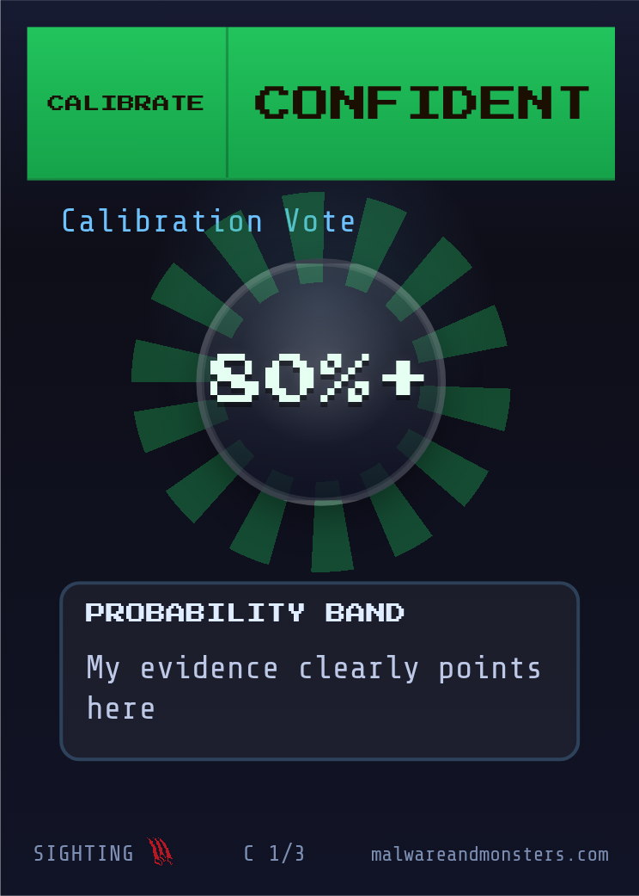

## {.cover data-visibility="uncounted"}

::: {.lockup}
[Malware [& Monsters]{.accent}]{.title}

[What a member takes home from a different kind of tabletop]{.subtitle}
:::

::: {.byline}
Klaus Agnoletti · i-4 · 14 September 2026
:::

::: {.notes}
- [3 MIN INTRO, Ronald opens: why he brought this to i-4. Klaus waits.]
- [FRAME] *"You're not the player in this room today, your members are. Watch for what a member would walk out with."*
- Then one line: *"Twenty years of running and sitting in incident exercises. I built this because of what I kept seeing."*
- Janina asked to see the gaming concept. She gets it on slides 2 to 4.
- [CLOCK] deck is about 10 minutes; leave 15 for her questions and for how i-4 sessions actually run
:::

## Where tabletops lose value {.vc}

Certain, wrong, fast

Read the steps, decide nothing

Rank wins the argument

"Could never happen here"

::: {.notes}
- [OPEN, no throat-clear] *"Every resilience programme runs the exercise. Few of them ever make someone commit to a call before they know if it is right."*
- [BUILD 1] certain, wrong, fast: the team knows the right actions; what breaks them is being sure, wrong and quick. Nobody has to say how sure they are
- [BUILD 2] the walkthrough: steps read aloud, nobody DECIDES. Say "the walkthrough", never "your exercise"
- [BUILD 3] the loudest senior wins the point, not the best reasoning
- [BUILD 4] "could never happen here" ends the learning on the spot
- Respect the format: it validates plans, roles, notifications. These are design failures, not the format's
- [90 s] bridge: *"You asked to see the gaming concept. Here it is."*
:::

## What Malware & Monsters is

::: {.notes}
- [POINT] a tabletop incident exercise on a role-playing engine
- A team plays CHARACTERS, not their job titles
- Facing a malmon: the incident given a face, so the room fights it instead of a status line
- Free and open, every scenario written out. Nothing to buy to try it
- [30 s] *"Here is what the table looks like."*
:::

## Around the table {.top}



Incident MasterCharacters, not titlesd20: does the call land

::: {.notes}
- [CLICK x6] Detective, Protector, Tracker, Communicator, Crisis Manager, Threat Hunter
- [POINT centre] the Incident Master runs the scenario; the malmon is the incident given a face
- Characters, not job titles: nothing to defend
- The die decides whether a call lands, not whether it was right
- [45 s] *"Let me show you one round."*
:::

## How a session runs {.top data-auto-animate="true"}

Scenario
→
Decision
→
Roll
→
Consequence
↻
Debrief

::: {.notes}
- [POINT along the loop] scenario, decision, roll, consequence, round again, then debrief
- Consequence is not a pre-planned inject: it answers what the room chose
- Debrief, plainly: guided, process gaps not blame, commitments with owners, follow-up. Same shape any programme produces
- [30 s] *"One decision, live. NIS2 early warning, the 24-hour clock."*
- [ADVANCE: the loop enlarges into the vignette]
:::

## How a session runs {.top data-auto-animate="true" data-visibility="uncounted"}

Scenario
→
Decision
→
Roll
→
Consequence
↻
Debrief

CALLDeputy, CISO unreachable: notify now, scope unknown

ROLLGood call. Bad roll.

CONSEQUENCERegulator asks a question nobody can answer yet

::: {.notes}
- [60 s VIGNETTE, character voice] 03:40, ransomware note on the file server, early-warning clock running
- [BUILD 1] the deputy character decides: notify the CSIRT now with what we have
- [POINT] the deputy decides for the first time, CEO on the line, CISO on a plane
- [SLOW] *"Picture one of your members here: some regimes give one hour to notify, this one twenty-four. The tightest one sets their night."*
- [BUILD 2] roll. Right decision, the dice go against it
- [SAY] in live drills the call is right about one time in five, even for teams who know the playbook (Immersive 2025)
- [BUILD 3] the regulator calls back with a question the room cannot answer yet. Now what do you tell the board?
- Point: a good decision met a bad outcome, and the room still has to act. That is the instinct we train
- [RONALD 30 s, scripted] one line on what happened at his table in Sofia
- Bridge: *"So what is actually different here?"*
:::

## What this adds

<b>Role, not title.</b> The safe answer has no owner to protect

<b>Consequences answer the decision.</b> A good call can still go wrong

<b>The room laughs.</b> So it argues. So it tells the truth

::: {.notes}
- First, what conventional exercises do WELL: validate plans, roles, notification paths. Keep them
- [BUILD 1] role not title: the Detective speaks, not the Head of Infrastructure. Nothing to defend
- [POINT] when a member's deputy is cast as decider, their succession gap shows up here, not on a title
- [BUILD 2] consequences respond to the choice, dice add the uncertainty real incidents have
- [BUILD 3] [SAY IT STRAIGHT] *"There is no study behind this."*
- [VERBATIM] *"What I see is people laugh, so they argue, so they say what they actually think."*
- [RONALD, one line] he saw the same in Sofia
- [TIME CHECK: past 7 min here, cut Ronald's Sofia line, go straight to the bridge]
- [90 s] bridge: *"One more piece, because it travels."*
:::

## The Presumption Deck {.vc}

Wrong isn't the expensive failure. <em>Sure and wrong is.</em>

<ul><li class="fragment" data-fragment-index="1">CALL</li><li class="fragment" data-fragment-index="2">COMMIT</li><li class="fragment" data-fragment-index="3">REVEAL</li></ul>

::: {.notes}
- [READ THE LINE ONCE, then stop]
- [POINT at the cards] type, confidence, readiness: three cards, one call
- [BUILD 1] CALL: say what you presume about the incident before the facts arrive
- [BUILD 2] COMMIT: out loud, in front of your peers
- [BUILD 3] REVEAL: the facts land. Sure and wrong costs more than wrong
- Calibration is the skill nobody trains; this makes it a habit inside the exercise
- [LIMIT] this exposes a member's confidence at the moment of decision, not readiness or lasting change
- [IF ASKED for evidence] the premortem: imagining the outcome as already happened raises the reasons people find by about a third
- [60 s] bridge: *"So what does a member actually walk out with?"*
:::

## What a member takes home {.top}

1Someone commits to a call before the consequence exists

2The deputy makes the call, no title on trial

3Sure and wrong, surfaced before the facts land

4Notify or wait, with the clock running

5A room that argues instead of nods

::: {.notes}
- [BUILD 1] *"Most exercises ask whether the plan was followed. This one makes someone choose before the consequence is known."* [LIMIT] not a validation of operational readiness
- [BUILD 2] *"Cast against title and their succession gap shows up, and nobody's job is on trial."* [LIMIT] governance and law decide who may sign
- [BUILD 3] the presumption said out loud before the facts land, so the debrief argues with the record [LIMIT] exposes confidence, does not prove calibration improves
- [BUILD 4] 03:40, clock running, root cause unknown: notify now or wait, then live with what follows [LIMIT] drafts no notification, maps no regime
- [BUILD 5] [SAY IT STRAIGHT] *"There is no study behind this. It is what I see in every room I run."*
- [LIMIT] *"One session will not make a member resilient. It gives their next exercise a decision to argue about."*
- [CLOSE] *"That is what a member walks out with."*
- [STOP TALKING. The rest of the half hour is hers]
- [IF EXEC VERSION] *"That's the right question to ask on their behalf. I'd rather leave it open than promise a format today."*
- [IF RECORD] the host decides its own record under its own advice; this format does not make it privileged
- [IF AUTHORITY] NIS2 Article 20 puts approval, oversight and training on the management body; incident authority still comes from the organisation, this rehearses it
:::
