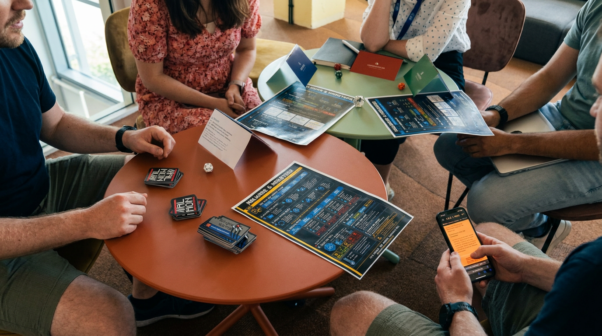
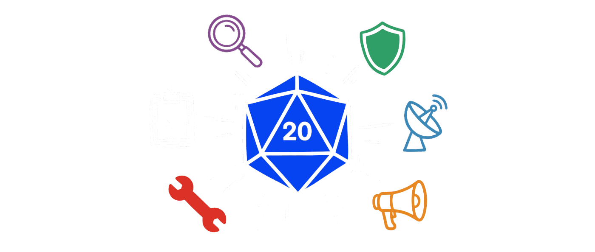
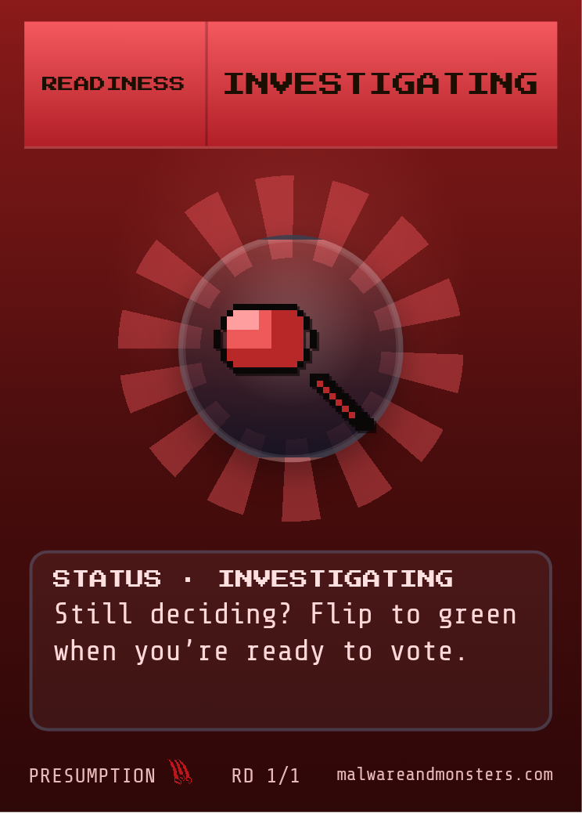

## {.cover data-visibility="uncounted"}

::: {.lockup}
[Malware [& Monsters]{.accent}]{.title}

[What a member takes home from a different kind of tabletop]{.subtitle}
:::

::: {.byline}
Klaus Agnoletti · with Ronald Heil, KPMG Netherlands · i-4 · 14 September 2026
:::

::: {.notes}
- [3 MIN INTRO, Ronald opens: why he brought this to i-4. Klaus waits.]
- [FRAME] *"You're not the player in this room today, your members are. Watch for what a member would walk out with."*
- Then one line: *"Twenty years of running and sitting in incident exercises. I built this because of what I kept seeing."*
- Janina asked to see the gaming concept. She gets it on slides 2 and 3.
- [CLOCK] deck is about 10 minutes; leave 15 for her questions and for how i-4 sessions actually run
:::

## Where tabletops lose value {.vc}

<svg class="gates" viewBox="0 0 1100 300" xmlns="http://www.w3.org/2000/svg" role="img" aria-label="A decision token passes four gates and fades">
  <line class="track" x1="40" y1="150" x2="1060" y2="150"/>
  <g class="gate"><rect x="220" y="70" width="18" height="160" rx="4"/><rect x="480" y="70" width="18" height="160" rx="4"/><rect x="740" y="70" width="18" height="160" rx="4"/><rect x="1000" y="70" width="18" height="160" rx="4"/></g>
  <circle class="tok" cx="110" cy="150" r="34"/>
  <circle class="tok tok--1 fragment" data-fragment-index="1" cx="360" cy="150" r="34"/>
  <circle class="tok tok--2 fragment" data-fragment-index="2" cx="620" cy="150" r="34"/>
  <circle class="tok tok--3 fragment" data-fragment-index="3" cx="880" cy="150" r="34"/>
  <circle class="tok tok--4 fragment" data-fragment-index="4" cx="1070" cy="150" r="34"/>
</svg>

Certain, wrong, fastRead the steps, decide nothingRank wins the argument"Could never happen here"

::: {.notes}
- [OPEN, no throat-clear] *"Every resilience programme runs the exercise. Few of them ever make someone commit to a call before they know if it is right."*
- [BUILD 1] certain, wrong, fast: the team knows the right actions; what breaks them is being sure, wrong and quick. Nobody has to say how sure they are
- [BUILD 2] the walkthrough: steps read aloud, nobody DECIDES. Say "the walkthrough", never "your exercise"
- [BUILD 3] the loudest senior wins the point, not the best reasoning
- [BUILD 4] "could never happen here" ends the learning on the spot
- Respect the format: it validates plans, roles, notifications. These are design failures, not the format's
- [90 s] bridge: *"You asked to see the gaming concept. Here it is."*
:::

## What Malware & Monsters is

::: {.notes}
- [POINT] a tabletop incident exercise on a role-playing engine
- A team plays CHARACTERS, not their job titles
- Facing a malmon: the incident given a face, so the room fights it instead of a status line
- An Incident Master runs the scenario; dice decide whether a call lands
- Free and open, every scenario written out. Nothing to buy to try it
- [60 s] *"Let me show you one round."*
:::

## How a session runs {.top data-auto-animate="true"}

Scenario
→
Decision
→
Roll
→
Consequence
↻
Debrief

::: {.notes}
- [POINT along the loop] scenario, decision, roll, consequence, round again, then debrief
- Consequence is not a pre-planned inject: it answers what the room chose
- Debrief, plainly: guided, process gaps not blame, commitments with owners, follow-up. Same shape any programme produces
- [30 s] *"One decision, live. NIS2 early warning, the 24-hour clock."*
- [ADVANCE: the loop enlarges into the vignette]
:::

## How a session runs {.top data-auto-animate="true" data-visibility="uncounted"}

Scenario
→
Decision
→
Roll
→
Consequence
↻
Debrief

CALLDeputy, CISO unreachable: notify now, scope unknown

ROLLGood call. Bad roll.

CONSEQUENCERegulator asks a question nobody can answer yet

::: {.notes}
- [60 s VIGNETTE, character voice] 03:40, ransomware note on the file server, early-warning clock running
- [BUILD 1] the deputy character decides: notify the CSIRT now with what we have
- [POINT] the deputy decides for the first time, CEO on the line, CISO on a plane
- [SLOW] *"Picture one of your members here: some regimes give one hour to notify, this one twenty-four. The tightest one sets their night."*
- [BUILD 2] roll. Right decision, the dice go against it
- [SAY] in live drills the call is right about one time in five, even for teams who know the playbook (Immersive 2025)
- [BUILD 3] the regulator calls back with a question the room cannot answer yet. Now what do you tell the board?
- Point: a good decision met a bad outcome, and the room still has to act. That is the instinct we train
- [RONALD 30 s, scripted] one line on what happened at his table in Sofia
- Bridge: *"So what is actually different here?"*
:::

## What this adds

<b>Role, not title.</b> The safe answer has no owner to protect

<b>Consequences answer the decision.</b> A good call can still go wrong

<b>The room laughs.</b> So it argues. So it tells the truth

::: {.notes}
- First, what conventional exercises do WELL: validate plans, roles, notification paths. Keep them
- [BUILD 1] role not title: the Detective speaks, not the Head of Infrastructure. Nothing to defend
- [POINT] when a member's deputy is cast as decider, their succession gap shows up here, not on a title
- [BUILD 2] consequences respond to the choice, dice add the uncertainty real incidents have
- [BUILD 3] [SAY IT STRAIGHT] *"There is no study behind this."*
- [VERBATIM] *"What I see is people laugh, so they argue, so they say what they actually think."*
- [RONALD, one line] he saw the same in Sofia
- [TIME CHECK: past 6 min here, cut Ronald's Sofia line, go straight to the bridge]
- [90 s] bridge: *"One more piece, because it travels."*
:::

## The Presumption Deck {.vc}

Wrong isn't the expensive failure. <em>Sure and wrong is.</em>

<ul><li class="fragment" data-fragment-index="1">CALL</li><li class="fragment" data-fragment-index="2">COMMIT</li><li class="fragment" data-fragment-index="3">REVEAL</li></ul>

::: {.notes}
- [READ THE LINE ONCE, then stop]
- [BUILD 1] CALL: say what you presume about the incident before the facts arrive
- [BUILD 2] COMMIT: out loud, in front of your peers
- [BUILD 3] REVEAL: the facts land. Sure and wrong costs more than wrong
- Calibration is the skill nobody trains; this makes it a habit inside the exercise
- [LIMIT] this exposes a member's confidence at the moment of decision, not readiness or lasting change
- [IF ASKED for evidence] the premortem: imagining the outcome as already happened raises the reasons people find by about a third
- [POINT at the card] one card does the whole job at the table
- [60 s] bridge: *"So what does a member actually walk out with?"*
:::

## What a member takes home {.vc}

1session at the table

Why their own exercises end in nods

A technique that fits inside an existing programme

One decision felt live, not described

"Sure and wrong" as a debrief question

::: {.notes}
- [BUILD 1] a diagnosis they can take back to their own programme
- [BUILD 2] role-not-title and consequence-that-answers work inside any exercise they already run. Nothing to buy
- [BUILD 3] they sit in one decision at the table and feel the gut drop
- [BUILD 4] one question for every debrief from now on: how sure were we, and were we right
- [LIMIT] *"One session will not make a member resilient. It gives their next exercise a decision to argue about."*
- [CLOSE] *"That is what a member walks out with."*
- [STOP TALKING. The rest of the half hour is hers]
- If she asks what to tell Neil: *"It gives members a reusable way to test assumptions and decisions under uncertainty, then turn the discussion into owned corrective actions."*
- [IF EXEC VERSION] *"That's the right question to ask on their behalf. I'd rather leave it open than promise a format today."*
- [IF RECORD] the host decides its own record under its own advice; this format does not make it privileged
- [IF AUTHORITY] NIS2 Article 20 puts approval, oversight and training on the management body; incident authority still comes from the organisation, this rehearses it
:::

