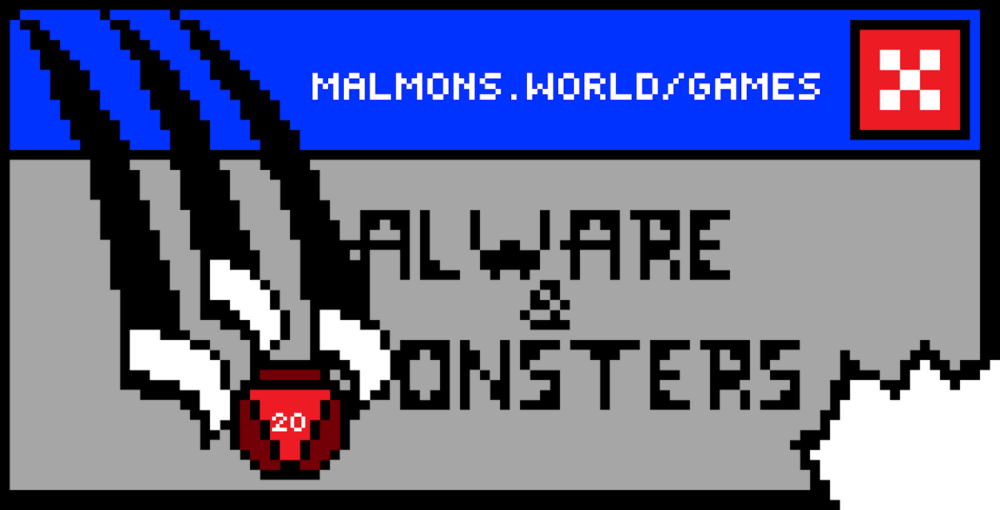
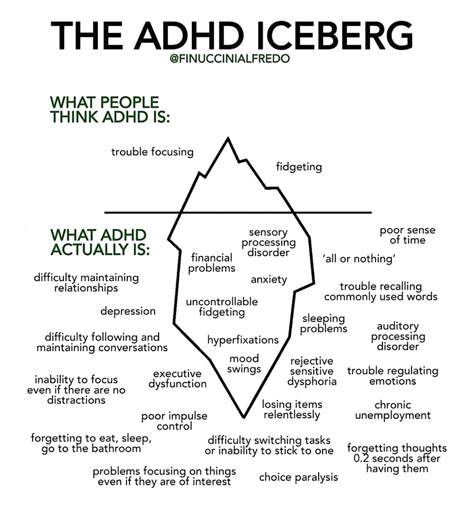
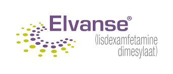
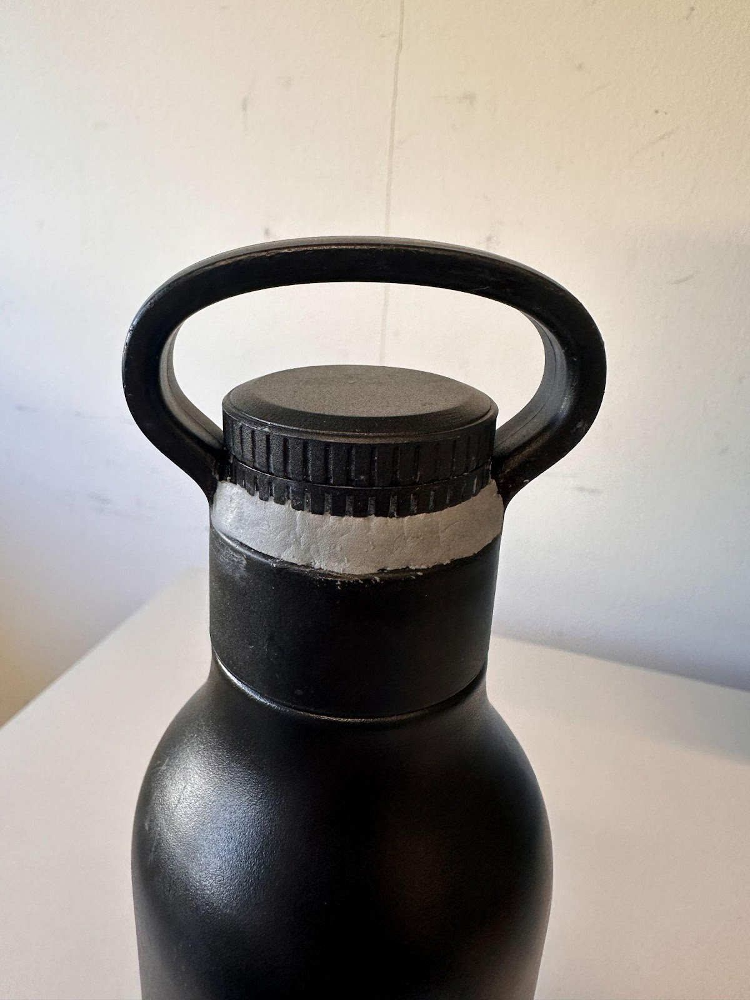
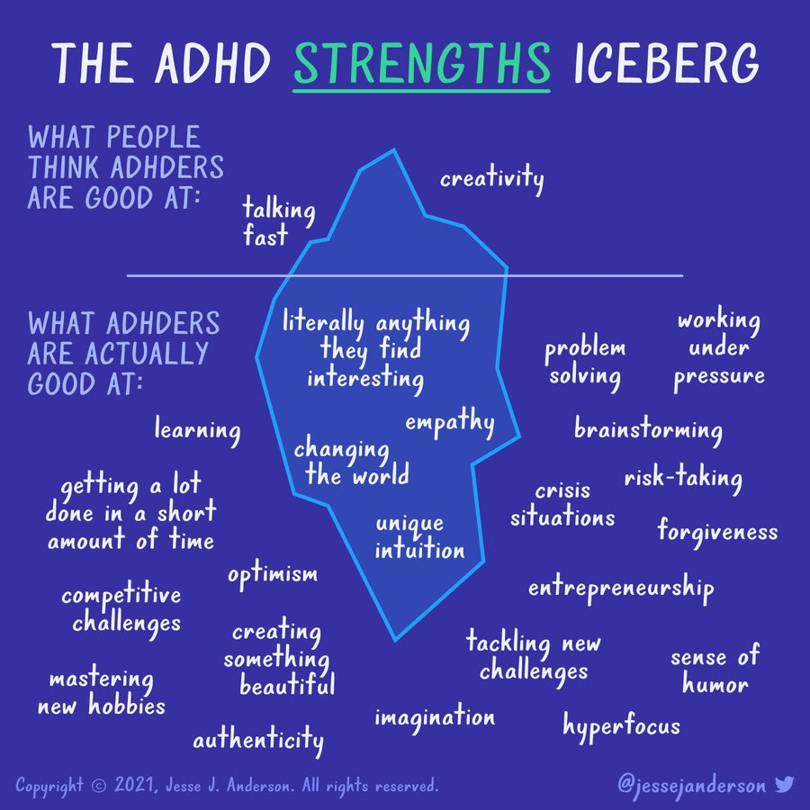
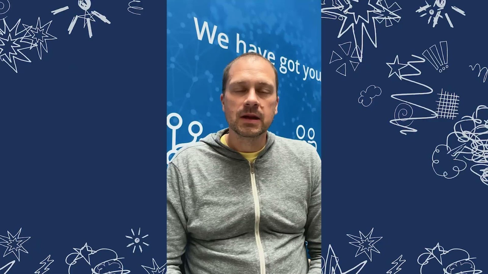
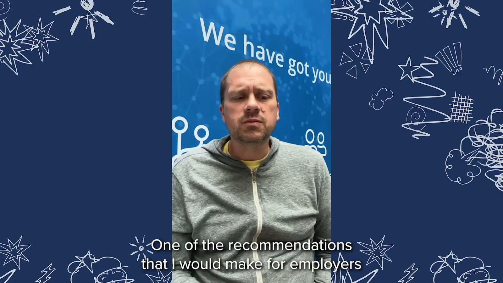

## {background-image="images/s01_0.png" background-size="cover"}

::: {.notes}
Welcome to my talk on living with ADHD in infosec
It’s called ‘still’ because there used to be a previous version and I had to make changes to not do the same talk all over again :-)
Met a lot of ADHDers since I started talking about ADHD 4 years ago
Conclusion: Everybody has something! 
So we need to talk more about it. 
Hence this talk

Graphics by my friends in Black Rabbit (made Project 2030 with Trend Micro).
Done this pro bono. So give them love!
Obviously it’s a very personal talk
I do it to 
raise awareness about what ADHD also is
break down taboos 
hopefully inspire others to break the taboo, get a diagnosis or just get a better life.
Illustration. Very accurate, big mess inside my head, prevent concentration

My story is my story
Yours is not the same. Maybe you can recognize elements. Maybe something I say can help you. 
I hope so.
:::

## {background-image="images/s02_0.png" background-size="cover"}

::: {.notes}
Anyone here has black pets? Then you know the challenge
Worst thing about black cats is.. 
I’m Klaus, aged 50 and live in Copenhagen with my wife and our two shelter cats (yes, they’re brother and sister)
Been in infosec since 2004
During that time I’ve gained experience with many areas of security
Funny enough I’ve always wanted to try new things all the time.
So I’ve done everything from source code reviews and vulnerability scanning to security training, governance, risk, compliance (GRC), maturity assessments and used to work as a security architect at a few companies before my career took a turn.
Involved in local OWASP chapter since 2008 and co-founded BSides Copenhagen in 2019
Used to be head of community at CrowdSec.
Combination of a technical role with marketing and communications until december 2022.
After this I went freelance aiming to help companies both get more secure but 
also teaching them to use the infosec community as a marketing channel both to bring business and talent.
No need to take photos of slides since QR code to download is on the last page.
:::

## {background-image="images/bg-texture.png" background-size="cover"}

:::{.absolute style="top:37px;left:72px;width:906px;font-size:58px;color:#3c78d8;font-weight:700;text-align:left;line-height:1.2;"}
But first let’s talk about games
:::

{.absolute top=194 left=98 width=426}

{.absolute top=194 left=630 width=295}

:::{.absolute style="top:483px;left:59px;width:500px;font-size:20px;color:#1a1a1a;font-weight:400;text-align:left;line-height:1.2;"}
malwareandmonsters.com
:::

::: {.notes}
I’m a big advocate for mixing fun and learning - especially games and learning
It makes learning fun = engagement
Malware & Monsters is old school analogue game IR
Focus for now on malware containment
Free to use - easy to get started
Zero prep scenarios
Get stickers!

Now let’s get on to the serious part!
:::

## {background-image="images/s04_0.png" background-size="cover"}

::: {.notes}
I was fired twice in the two last years as normal employee.
Best thing that happened..
Good opportunity to stop and reflect over my situation
Let me start from the beginning
You see, I may look relatively normal. 
But looks deceive..
:::

## {background-image="images/bg-texture.png" background-size="cover"}

:::{.absolute style="top:40px;left:36px;width:978px;font-size:58px;color:#3c78d8;font-weight:700;text-align:left;line-height:1.2;"}
I have ADHD.. and it’s ok
:::

:::{.absolute style="top:171px;left:36px;width:835px;font-size:41px;color:var(--ink);font-weight:400;text-align:left;line-height:1.2;"}
Was diagnosed 6 years ago, aged 45  
That explained a lot to me..  
Increasingly harder to find a job I cared about  
Many short employments  
Something had to change
:::

::: {.notes}
Was diagnosed 6 years ago
Not unusual with ADD (no hyperactivity) - no telltale signs
That explained a lot to me 
increasing problems concentrating for approx 15 years without having a clue why.
Increasingly harder to get a job I cared about
Among other things led to me not being very effective.
Definitely one reason (of many) to me having short employments and getting fired
Over and over
Started to burden me (and my wife). 
So something just had to change..
:::

## {background-image="images/s06_1.png" background-size="cover"}

::: {.notes}
But first: let me tell you a bit about ADHD
I didn’t know anything about ADHD before I was diagnosed. 
So I assume you don’t either
:::

## {background-image="images/s07_0.png" background-size="cover"}

:::{.absolute style="top:40px;left:36px;width:978px;font-size:58px;color:#ff9900;font-weight:700;text-align:left;line-height:1.2;"}
ADHD? ADD?
:::

:::{.absolute style="top:167px;left:36px;width:978px;font-size:32px;color:var(--ink);font-weight:400;text-align:left;line-height:1.2;"}
AD/HD  
Attention Deficit /  
Hyperactivity Disorder  
Can have both or just one  
Attention Deficit alone = ADD
:::

::: {.notes}
Welcome to ADHD 101
Attention Deficit /Hyperactivity Disorder
Can have one or both. Still ADHD.
So much more than that annoying kid who can’t sit still in school.

Without hyperactivity it’s sometimes called ADD.
The chaos is ‘just’ inside your brain
Getting a diagnosis late in life is quite normal 
(especially being my age. ADHD didn’t exist in the eighties)
ADHD can take many shapes and forms
Yet many things can be in common and connected. 
And when I found that out it was groundbreaking. 
All of a sudden there was an explanation to many of those shortcomings
That had all just been there always
:::

## {background-image="images/s08_0.png" background-size="cover"}

:::{.absolute style="top:678px;left:103px;width:344px;font-size:61px;color:#feae08;font-weight:700;text-align:right;line-height:1.2;"}
The ADHD iceberg
:::

{.absolute top=0 left=379 width=616}

:::{.absolute style="top:0px;left:846px;width:204px;font-size:20px;color:#ff0000;font-weight:700;text-align:left;line-height:1.2;"}
@finuccinalfredo
:::

::: {.notes}
Enter the ADHD Iceberg of common misperceptions
I came across this looking for a way to illustrate what ADHD is as well 
as common misperceptions

My challenges:
First primary: 
Focus. I usually can’t concentrate (although things have gotten better with my own mitigations)
Second primary: 
Sensory Processing Disorder (had to look that one up). Rarely feel any mood swings. At all. Both good and bad.
Poor sense of time. I’m a lousy planner. Really. 
Trouble recalling common words. Really annoying. 
Difficulty switching tasks
Choice Paralysis: I hate Netflix. Too much to watch. Makes me dizzy.
Poor impulse control: When I get the thought or impulse of something I want to eat, hard to let go. Hello future obesity. 
Forgetting thoughts. Also bad at remembering names (don’t take it personal) as well as movies and TV shows I’ve seen (Not necessarily a bad since I can rewatch The Mandalorian when I get bored of the other Star Wars spin offs)
All or nothing: If a customer won’t do security properly but wants to cut corners, they can kiss my butt (Is what I want to say.. but I don’t. Speaking of thing you learn along the way from own experience)
Executive Dysfunctions: Sometimes I just say stuff. Sometimes that’s a really bad idea. 
Difficulty Following and maintaining conversations: Not so bad - unless I meet someone with the same ADHD type. Wow. Impossible to keep track of any kind of direction.
Chronic Unemployment. Ok, not THAT bad but I see a trend in my challenges and overall statistics. 
Looking at this I feel incredibly lucky. Things could have been a lot harder.
:::

## {background-image="images/s09_1.png" background-size="cover"}

{.absolute top=109 left=568 width=406}

::: {.notes}
Overview from before is taken from ASRS
Adult ADHD Self-Report scale (ASRS). 
Made by WHO
Test yourself for ADHD (later, not now :-)
First time I saw this, it blew me away
Suddenly there was reasoning for and connection between 
many of those seamlessly stupid and unexplainable things I did
:::

## {background-image="images/s10_0.png" background-size="cover"}

::: {.notes}
Important thing to say:
You are not ADHD - you HAVE ADHD
Meaning:
You have challenges. They can be overcome.
Key is knowledge:
Know about ADHD
Know yourself
So you can mitigate
:::

## {background-image="images/bg-texture.png" background-size="cover"}

:::{.absolute style="top:40px;left:36px;width:978px;font-size:61px;color:var(--ink);font-weight:700;text-align:left;line-height:1.2;"}
Mitigating
:::

:::{.absolute style="top:167px;left:44px;width:710px;font-size:32px;color:var(--ink);font-weight:400;text-align:left;line-height:1.2;"}
Medicine  
Elvanse, Vyvanse, Aduvanz (same thing)
:::

:::{.absolute style="top:379px;left:44px;width:936px;font-size:32px;color:var(--ink);font-weight:400;text-align:left;line-height:1.2;"}
Headphones with ‘ADHD focus music’ or binaural beats
:::

{.absolute top=432 left=510 width=524}

:::{.absolute style="top:273px;left:44px;width:908px;font-size:32px;color:var(--ink);font-weight:400;text-align:left;line-height:1.2;"}
Nootropics  
L-Theanine, L-Tyrosine, Multi vitamin, Lithium Orotate
:::

{.absolute top=341 left=541 width=278}

:::{.absolute style="top:432px;left:44px;width:562px;font-size:32px;color:var(--ink);font-weight:400;text-align:left;line-height:1.2;"}
Loop earplugs (model ‘switch’)
:::

::: {.notes}
<DON’T CLICK>
Here’s a list of things I’ve done to cope better
Maybe it can help you too
Understanding your ADHD is vital so you can mitigate
<CLICK>
Medicine made a huge difference to me. Considered not driving car anymore
Better at deep conversations with wife and board games (which we love)
Three names, one drug: Lisdexamfetamine
<CLICK>
I recommend googling ‘nootropics adhd stack’ for inspiration
This is what works for me
L-Theanine, L-Tyrosine are amino acids 
Helps me concentrate
Take 30 mins before breakfast
Lithium Orotate helps brain get energy (fat, getting older)
<CLICK>
Focus music makes my brain not fighting concentration
<CLICK>
Loop earplugs. A life savior at DEF CON!
:::

## {background-image="images/bg-texture.png" background-size="cover"}

:::{.absolute style="top:40px;left:36px;width:978px;font-size:61px;color:var(--ink);font-weight:700;text-align:left;line-height:1.2;"}
Mitigating (cont’d)
:::

:::{.absolute style="top:226px;left:36px;width:606px;font-size:32px;color:var(--ink);font-weight:400;text-align:left;line-height:1.2;"}
Breathing exercises  
Art of Living / Breathe Smart
:::

:::{.absolute style="top:466px;left:51px;width:344px;font-size:32px;color:var(--ink);font-weight:400;text-align:left;line-height:1.2;"}
Job situation
:::

{.absolute top=296 left=786 width=209}

:::{.absolute style="top:149px;left:36px;width:438px;font-size:32px;color:var(--ink);font-weight:400;text-align:left;line-height:1.2;"}
Airtag all the things!
:::

{.absolute top=50 left=567 width=289}

:::{.absolute style="top:342px;left:44px;width:510px;font-size:32px;color:var(--ink);font-weight:400;text-align:left;line-height:1.2;"}
AI  
PAI by Daniel Miessler
:::

::: {.notes}
<CLICK>
Airtag everything you can - bags, bottles, bicycle etc
<CLICK>
Remember the noise in my head? Breathing exercises makes them go away.
I don’t understand how exercises work. But they do.
This happy Indian guy: Art of Living. Available everywhere
Seems like a bit of a cult though
But exercises work so I don’t care
<CLICK>
AI takes away cognitive load - literally a gamechanger
Make AI your digital assistant. It does all the things I hate
PAI

And job.. Yes.. What to do with that?
:::

## {background-image="images/s13_0.png" background-size="cover"}

:::{.absolute style="top:40px;left:36px;width:978px;font-size:61px;color:var(--ink);font-weight:700;text-align:left;line-height:1.2;"}
Why getting fired was a good thing
:::

:::{.absolute style="top:149px;left:36px;width:978px;font-size:34px;color:var(--ink);font-weight:400;text-align:left;line-height:1.2;"}
Working towards what I am good at and requires:  
Diversity in tasks  
Only accept tasks I want  
Flexibility in working (when, how)  
Need for things to be simpler to be motivating  
  
Conclusion:  
I’m going freelance!
:::

::: {.notes}
So back to why getting fired was good for me
First time fired: First change in career path: marketing and community. Not quite there
Second time fired: Experience with new career path, Inspired to do last adjustments and go freelance
Getting fired all the time means insecurity. I don’t want that anymore
Best way for that is to be your own boss and go freelance. 

Diversity in task - I get to do different things, fun things
Work when my brain works
Need for things to be simpler, meaning, if I don’t do a good job I won’t have any money. 
That’s very easy for even my brain to understand. 
That’s motivating!
:::

## {background-image="images/s14_0.png" background-size="cover"}

::: {.notes}
Here’s an overview of things I learned along the way
Maybe that can help you out if you’re in a similar situation
:::

## {background-image="images/s15_0.png" background-size="cover"}

:::{.absolute style="top:40px;left:36px;width:978px;font-size:61px;color:#ff9900;font-weight:700;text-align:left;line-height:1.2;"}
Lessons learned
:::

:::{.absolute style="top:167px;left:36px;width:978px;font-size:36px;color:var(--ink);font-weight:400;text-align:left;line-height:1.2;"}
No problem? Don’t try to fix it then!  
ADHD is ‘normal’ to have. Nothing to be ashamed about  
Find your weaknesses/super powers.  
Mitigate weaknesses - enhance super powers
:::

::: {.notes}
Don’t get a diagnosis if you don’t have a problem
Once you’re diagnosed, there’s no turning back
Life insurance issues..
ADHD is normal (at least in our line of business)
Find your strengths and your weaknesses
What if you were shortsighted. Wouldn’t you try to compensate?
Same thing with ADHD
Embrace and accept your weaknesses - find out what helps you mitigate them. 
Find your super powers - find out which ADHD trait makes you excel
Turn your career towards that if needed
:::

## {background-image="images/bg-texture.png" background-size="cover"}

:::{.absolute style="top:180px;left:149px;width:641px;font-size:98px;color:#3c78d8;font-weight:700;text-align:left;line-height:1.2;"}
Talking about Super powers
:::

:::{.absolute style="top:69px;left:1005px;width:344px;font-size:61px;color:#3c78d8;font-weight:700;text-align:left;line-height:1.2;"}
Talking about Super powers
:::

{.absolute top=27 left=51 width=587}

::: {.notes}
Talking about super powers and icebergs: Meet the ADHD Strengths iceberg
Learn about my strenghts too as a bonus!
Literally anything interesting: Anyone recognize this? I do :-)
Authenticity: WYSIWYG. Luckily, where I come from, that is (mostly) a strength
Brainstorming/creativity: Good at continue thinking upon other’s ideas 
Optimism/stupidity. ‘What can go wrong with this freelancing thing?’
And yes, I’m incredibly funny. At least I think so myself.
:::

## {background-image="images/s17_0.png" background-size="cover"}

:::{.absolute style="top:40px;left:36px;width:978px;font-size:61px;color:#ff9900;font-weight:700;text-align:left;line-height:1.2;"}
Lessons learned (cont’d)
:::

:::{.absolute style="top:167px;left:36px;width:978px;font-size:36px;color:var(--ink);font-weight:400;text-align:left;line-height:1.2;"}
When people know they can better understand; spouse, friends, employer.  
If you’ve met one person with ADHD..  
This is my ADHD. Not anyone else’s
:::

::: {.notes}
Sorry, got rabbitholed a bit there. Know that?
Back on track!

When people know that you’re not neurotypical they can better understand. It’s hard for them to be mad at you.
Goes for everybody in your life: spouse, friends - even employers.
When you met one person with ADHD you’ve met one person with ADHD. 
Today I have described my ADHD. Not yours or anyone else’s
:::

## {background-image="images/s18_bg.png" background-size="cover"}

:::{.absolute style="top:295px;left:268px;width:515px;font-size:61px;color:#ffffff;font-weight:700;text-align:left;line-height:1.2;"}
I asked a friend..
:::

::: {.notes}
So now you’ve heard my story
This time around I brought in the life story of a friend. You might have seen him before.
:::

## {background-image="images/s19_bg.png" background-size="cover"}

:::{.absolute style="top:220px;left:171px;width:709px;font-size:61px;color:#ffffff;font-weight:700;text-align:left;line-height:1.2;"}
I asked my friend John Strand, CEO of Black Hills Information Security..
:::

::: {.notes}
So now you’ve heard my story
This time around I brought in the life story of my friend John Strand
:::

## {background-image="images/s20_bg.png" background-size="cover"}

{.absolute top=0 left=0 width=1050}

::: {.notes}
Transcription:So I wanted to talk a little bit about what I've dealt with insofar as ADHD and some of my history.
One of the things that I'm very lucky about is I was diagnosed very early on in grade school.
So that was great. They understood that there was an issue because I couldn't sit still in a classroom.
I couldn't focus on the task at hand for any period of time.
And my teachers recognized the problem. My parents recognized the problem.
And I was able to get access to some help in coming up with strategies at a very young age
to deal with it.
Now first I want to talk about the drugs.
I was very early in the drug scheme back in the mid 80s, late 80s, 90s.
So a lot of the drugs I was taking were Omipramine, Desipramine, Ritalin.
A lot of the drugs that they don't use so much anymore.
And I was on ridiculous amounts.
Because the problem was if John still is disruptive, if John still isn't sitting in his desk,
give him more drugs was the solution.
So they kept upping things until I was relatively stoned most of the time in my class.
After a while I cut those drugs off because they were creating issues for me.
And I developed a number of ways to try to deal with ADHD in an effective way.
And those really didn't get sharpened to the point where I feel I'm good at it until I was in college.
So some of the strategies that I have which are absolutely different from what other people may come down with strategies
is to stop trying to force myself to be normal.
Stop trying to force myself to sit at a desk for eight hours.
Stop trying to force myself to basically learn the way that other people learn.
So some of the strategies that I employed was number one, sit in the back of rooms.
Because it'll allow me to stand up, move around, leave the room in such a way that's not disruptive to the people around me.
Number two, I learned very, very, very early on due to some teachers that were fantastic that I needed to shut up and listen.
It's very difficult for people with ADHD to do effectively.
But I have to keep telling myself most of the time no one wants to hear what I have to contribute unless you're the presenter.
The final thing that I did is I learned that if I can only learn and process in about 15 to 20 minute chunks, don't fight it.
So work in one thing for 15 to 20 to 25 to 30 minute chunks and then switch to a completely different thing.
So that way my ADHD is constantly being fed something different.
The final thing that I do with my ADHD that I think helps is if I'm working on something
and I'm coming up against that 15, 30 minute or hour window and I'm still interested, keep going.
Take advantage of your time because ADHD people definitely have difficulty kind of keeping attention on something.
But when we do, we obsess over it.
And I was lucky enough to get into computer security, which allowed me to be obsessed about a topic that was able to feed my family and become a career.
Getting diagnosed is the first step to, of course, to realizing you have a problem and coming up with strategies to deal with it.
Because it's not that there's anything wrong with you.
You're just different.
But you do have to learn how to deal with that.
And it doesn't have to be a disability.
It can be an asset to you.
It can be asset to your career.
But you have to understand, OK, I think this way.
I need to change my patterns of behavior to more align with something that is socially acceptable.
I'm not saying be like everybody else.
I'm not saying strive to be like everyone that you work with.
But you need to find ways to take those sharp edges that come with neurodivergence and grind them down a little bit so they aren't so sharp.
Whenever you're working with ADHD, you'll not go in a straight line of thought.
You'll get into a bunch of weird tangents going into a number of different places.
And I think that that creates a really cool diversity of thought as long as you can keep rolling towards the specific objective of the problem that you're trying to solve.
So you tend to see a lot of people with very heavy ADHD, they tend to be some of the best penetration testers in the world because they think about problems in nonstandard ways.
And they come at solutions from angles that normal people just wouldn't come up with.
I think in some ways it makes me different.
And different can be interesting.
Different can be fun.
Different means that there's more experiences that we tend to jump around if we can get into a good career field.
So I value and I cherish all of those things.
When you're looking at computer security, it's not like one thing.
Like if I was doing engineering, let's say structural engineering, that's a very diverse topic.
But it tends to be a very well-trod topic, right?
And if you look at computer security, you can be web application security, you can be operating system security, architecture, you can do cloud security.
There's so many different things that you can get into that normal people, I think, look at that huge spread and it's terrifying.
For someone who has ADHD, they're like, this is my home.
Because you can focus on this, then this is going to be a problem that takes your attention.
Then this is a problem that takes your attention.
The biggest thing that you need to do if you have ADHD is really, really focus on completion.
Take your tasks, and instead of focusing on the biggest task, take small tasks, finish small tasks, and then work your way up.
So trying to get that across for people that have ADHD and with myself is really, really, really important.
Because this is such a dynamic field, and it's so diverse in all the things that we have, you can lose yourself in it.
So it requires you to try to tune yourself in little small areas so that you can confront computer security, you can confront meetings,
you can confront the things that you're dealing with in such a way where you can be effective.
Even now, looking at this camera without my eyes, looking at the person that's over there or what's up there,
or the leaf that just moved, or the purple on those particular shirts, and not having my eyes go everywhere,
is an absolutely strenuous amount of effort for me to just stay focused on one spot.
But that's a learned behavior.
So if you have ADHD, you can use it as a superpower.
But just like any superhero, whenever they first get their power, they need to learn how to control that power properly.
And that takes time, perseverance, and education.
And I'm not going to lie, it is hard.
But in this field, if you can learn how to tune it properly, you're going to do fantastic.
:::

## {background-image="images/s21_0.png" background-size="cover"}

:::{.absolute style="top:40px;left:36px;width:978px;font-size:61px;color:#ff0000;font-weight:700;text-align:left;line-height:1.2;"}
You might wonder..
:::

:::{.absolute style="top:162px;left:36px;width:978px;font-size:39px;color:var(--ink);font-weight:400;text-align:left;line-height:1.2;"}
Neurodivergence is over-represented in  
cyber security.  
  
Why is that?  
  
  

:::

::: {.notes}
Sorry, video became a little cheesy there. Blame my video guy (which is not me)

20 years of working with ADHD in infosec, getting the diagnosis, 
working with myself, getting fired and much more told me this.
John mentions this too. I think he has a point
Regardless of what this is how it is. Everyone has something
Because the upsides are actual advantages in many of the thighs we do.
That security analyst who found signs of an intruder in the log and falls into a deep hole of hyperfocus until they’ve know for sure.
That’s ADHD or autism right there. Diagnosed or not. Doesn’t matter.
And that’s totally fine.
But guess what: there’s a flipside. A person with needs that may differ from others to be happy.
Used to work at a customer in Copenhagen who needed help with CIS Control. 
Flexible seating.
Current boss told me of one guy on the team who spends three weeks getting used to a new seat every time he’s forced to change.
Is flexible seating really that important?
Not to my boss. Flexible seating may be company policy. But…
:::

## {background-image="images/s22_0.png" background-size="cover"}

::: {.notes}
You’re not drunk or having a severe case of amnesia.
This is not the front page you’re seeing again. One significant difference.
Also, this is not so much about ADHD but more about that people are different
And that we all have different needs.
:::

## {background-image="images/s23_0.png" background-size="cover"}

:::{.absolute style="top:40px;left:36px;width:978px;font-size:61px;color:#3c78d8;font-weight:700;text-align:left;line-height:1.2;"}
Advice for Employers
:::

:::{.absolute style="top:149px;left:36px;width:978px;font-size:35px;color:#666666;font-weight:400;text-align:left;line-height:1.2;"}
What is important to you?  
People all have different needs  
Be open to supporting that  
Don’t ask ‘what can I do to help you’  
  
Avoid letting people go is literally a win-win
:::

::: {.notes}
Disclaimer: Never been an employer - but have seem them screw up enough to be somewhat qualified
An an employer you need to focus
Focus on what really matters and what doesn’t.
Think more flexible: if a certain task is solved at an agreed upon time 
does it really matter what time of day and from where?

Different people has different needs
Some can’t function in open office space
some need help planning daily
some need to work on weird hours 
or whatever it can be.
Support those needs. Make clear to yourself what’s important from this employee
Focus on that.

Don’t ask ‘what can I do to help you’. 
Instead say ‘would it help if..’. People don’t know what they can ask.
Being more accepting and focusing on helping employees succeed is literally a win-win. For everybody.
:::

## {background-image="images/s24_bg.png" background-size="cover"}

:::{.absolute style="top:235px;left:78px;width:866px;font-size:53px;color:#ff9900;font-weight:700;text-align:left;line-height:1.2;"}
One thing is what I think..
:::

:::{.absolute style="top:377px;left:197px;width:655px;font-size:39px;color:#ff9900;font-weight:400;text-align:left;line-height:1.2;"}
So I asked my friend John again..
:::

::: {.notes}
One thing is what I think - I’m not an employer and probably will never be.
So I asked John again
:::

## {background-image="images/s25_bg.png" background-size="cover"}

{.absolute top=0 left=0 width=1050}

::: {.notes}
Transcription:

One of the recommendations that I would make for employers is to find a way to give constructive
feedback to people that are neurodivergent without it blowing up to the point to where
it becomes a personal attack on them. And that's tough. That's a really tough line to not cross,
right? So one of the things I recommend is if you have someone that's neurodivergent
right at the beginning, I think number one, give that feedback in a very timely fashion.
Don't wait two to three weeks. Don't wait a month until you have 150 instances of all these ways
that they're not doing their meetings. Give that feedback to somebody immediately. Number one,
do it in such a way that's not a direct personal attack. Like you can say, hey,
in that last meeting, um, you were kind of talking over some people. Could you do me a favor? Let
other people talk, take a breath and then respond. Let's practice that. Okay. If you have somebody
that's not paying attention in meetings, ask them what they need to be able to be effective in those
meetings and say, you want to sit in the back of the room so you can step out, take a quick pace
for a couple minutes and then come back and refocus and ask them what they need and be open
to what they say. Anybody hates constructive feedback and it's worse the longer it goes,
because if you give it a month, two months, three months, it turns into a personal attack by
default. I've been very blessed early on in my career where a lot of my negative ticks for ADHD
were picked up and recognized by a couple of managers that I worked with.
And they were very quick in their feedback. They were very timely in their feedback.
And they gave me alternative ways of dealing with it. And it was life-changing for me simply because
I had a manager who was willing to talk to me. Don't ever expect the whole world to bend over
backwards to meet you where you are. You need to understand that there's going to have to be some
things that you're going to have to change and you're still going to be different. You're still
going to be unique, but you can be wonderfully unique. It doesn't have to be something that is
painfully unique around the people that are around you. So embrace who you are, kind of learn how to
deal with the superpower that you have so you can channel it appropriately and learn how to
wield it in a way that makes you a better person.
:::

## {background-image="images/bg-texture.png" background-size="cover"}

:::{.absolute style="top:40px;left:36px;width:978px;font-size:61px;color:#3c78d8;font-weight:700;text-align:left;line-height:1.2;"}
Final Words
:::

:::{.absolute style="top:210px;left:48px;width:818px;font-size:38px;color:#000000;font-weight:400;text-align:center;line-height:1.2;"}
I started doing this to help others out  
I’m happy to have done this many times already  
I hope to have done the same here today
:::

::: {.notes}
I started doing this to help others out. Spread awareness.
Done that many times already
Turns out people need a role model
More than one person told me I’ve been the reason why they dare to be open. Dare to tell their employer.
For that I feel incredibly privileged.
I hope to have made a difference to someone in the room today.
That makes it all worth it.
:::

## {background-image="images/s27_0.png" background-size="cover"}

:::{.absolute style="top:40px;left:36px;width:978px;font-size:61px;color:var(--ink);font-weight:700;text-align:left;line-height:1.2;"}
I am always there to help
:::

:::{.absolute style="top:157px;left:75px;width:579px;font-size:32px;color:var(--ink);font-weight:400;text-align:left;line-height:1.2;"}
@klausagnoletti@infosec.exchange  
@klausagnoletti.bsky.social  
https://www.linkedin.com/in/agnoletti  
klaus@relationsec.net  
https://relationsec.net/  
Opinions (I have a lot of those)  
Whatever else I can help with (btw, I am freelance consultant)
:::

{.absolute top=164 left=39 width=33}

{.absolute top=282 left=36 width=33}

{.absolute top=331 left=32 width=40}

{.absolute top=392 left=32 width=40}

{.absolute top=144 left=654 width=363}

{.absolute top=223 left=36 width=33}

::: {.notes}
Reach out to me

But before we end I just want the opportunity to spread totally irrelevant messages now that I have a crowd.
:::

## {background-image="images/s28_0.png" background-size="cover"}

## {background-image="images/s29_0.png" background-size="cover"}

{.absolute top=38 left=512 width=526}

::: {.notes}
Thanks for your time
Scan QR code for slides
:::

